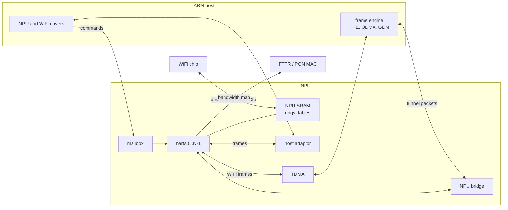

# Clankered Airoha AN75XX NPU Firmware

Bare-metal firmware for the RISC-V network processor (NPU) inside the
Airoha AN7552, AN7581 and AN7583 SoCs. The NPU is a cluster of RV32IMC
harts with no OS and no MMU. Each hart runs one polling loop. Together
they offload WiFi forwarding, tunnel header rewrites and GPON upstream
scheduling from the ARM host.

## Variants

| SoC | Harts | SRAM | WiFi chips | Extra features |
|---|---:|---:|---|---|
| AN7552 | 2 | 256 KB | MT7916, MT7991, MT7993 | none |
| AN7581 | 8 | 480 KB | MT7916, MT7992, MT7996 | tunnel offload, TR-471 |
| AN7583 | 6 | 512 KB | MT7916, MT7992, MT7993, MT7996, none | tunnel offload, GPON DBA |

MT7916 and MT7996 use the **kite** datapath; MT7991, MT7992 and MT7993
use the **eagle** datapath. Each SoC and WiFi pair is its own image.

## System overview



- The host loads the image, then configures every subsystem through the
  [mailbox](docs/mailbox.md).
- WiFi frames arrive from the WiFi chip in rings in NPU SRAM. The NPU
  sends them to the wired side over TDMA or to the host over the host
  adaptor ([eagle](docs/wifi-eagle.md), [kite](docs/wifi-kite.md),
  [DMA paths](docs/dma.md)).
- Packets that need a tunnel header rewrite pass through the NPU
  bridge ([tunnel offload](docs/tunnel.md)).
- On AN7583, core 5 builds the GPON upstream bandwidth map
  ([DBA](docs/dba.md)).

## Core map

Eagle WiFi:

| hart | AN7552 | AN7581 | AN7583 |
|---:|---|---|---|
| 0 | init, PPE return ISR; queue drain, rx refill | init | init, PPE return ISR; tunnel offload |
| 1 | rxdmad ring | rxdmad ring | rxdmad ring |
| 2 | | timer tick; WiFi tx | timer tick; WiFi tx |
| 3 | | host adaptor, tx done | host adaptor, tx done |
| 4 | | rx refill | rx refill |
| 5 | | idle | GPON DBA |
| 6 | | idle | |
| 7 | | tunnel offload, TR-471 | |

Kite WiFi:

| hart | AN7552 | AN7581 | AN7583 |
|---:|---|---|---|
| 0 | init, timer tick, BME ISR; node rings to host | init | init, BME ISR; tunnel offload |
| 1 | rx, both bands | rx | rx |
| 2 | | timer tick; 2.4 GHz rx or classifier | timer tick; 2.4 GHz rx or classifier |
| 3 | | node rings to host | node rings to host |
| 4 | | idle | idle |
| 5 | | idle | GPON DBA |
| 6 | | idle | |
| 7 | | tunnel offload, TR-471 | |

Harts shown idle, and any hart whose main function returns, serve the
[debug block](docs/debug.md) commands.

AN7583 without WiFi runs init and the tunnel offload on core 0, the
timer tick on core 2 and the package check on core 3. On AN7581 and
AN7583, core 3 first checks the package and powers down ports it does
not have. `core_dispatch()` in `npu_main.c` is the whole map.

## Build

Requires `riscv64-unknown-elf-gcc` (tested with GCC 14.2).

```sh
make SOC=AN7583 WIFI=MT7993        # one variant
make all-variants                  # all 11 variants
make SOC=AN7583 WIFI=MT7993 disasm # build/<variant>/firmware.dis
```

| variable | default | effect |
|---|---|---|
| `SOC` | `AN7583` | `AN7552`, `AN7581`, `AN7583` |
| `WIFI` | `MT7996` | `MT7916`, `MT7991`, `MT7992`, `MT7993`, `MT7996`, `NOWIFI` |
| `MAILTRACE` | 0 | 1 logs every WiFi mail from the mailbox ISR |
| `NPUTX` | 1 | 0 stages host tx frames but never writes the WiFi tx ring |
| `NPUDBG` | 0 | 1 starts with the WiFi and stats print bits of the [debug block](docs/debug.md) set |
| `PROF` | 0 | 1 builds the [profiler](docs/debug.md#profiling): section timers and PC sampling |
| `GITREV` | `git describe` | hash in the boot `NPU Version` line |
| `CROSS` | `riscv64-unknown-elf-` | toolchain prefix |

Outputs in `build/<SOC>_<WIFI>/`:

| file | content |
|---|---|
| `npu_rv32.bin` | code and rodata, loaded to DRAM at `0x84000000` |
| `npu_data.bin` | initialized data, loaded to SRAM at `0x3E900000` |
| `firmware.elf` | full ELF |
| `firmware.map` | linker map |

## Source layout

One file per subsystem. A file named after a chip family holds only that
family's code, behind the matching `#ifdef`.

| file | content |
|---|---|
| `crt0.S`, `link.ld` | reset vector, stacks, memory layout |
| `npu_main.c` | per-core entry points, core dispatch, trap handler, `npu_init` |
| `npu_globals.c` | every shared global; its order is the layout of `npu_data.bin` |
| `npu_mutex.c`, `npu_plic.c`, `npu_timer.c`, `npu_printf.c` | hardware mutex, interrupts, timers, console |
| `npu_mbox.c` | mailbox dispatch and host notify |
| `npu_dbg.c` | field debug block: heartbeats, counters, traces, host commands |
| `npu_sram.c` | SRAM allocator |
| `npu_util.c` | memset, memcpy, strlen, integer square root |
| `npu_bridge.c` | NPU bridge channels |
| `npu_tunnel.c`, `npu_l4s.c` | tunnel offload, L4S ECN marking |
| `npu_ppe.c` | chip capability table, PPE setup, HWNAT mail |
| `npu_tr471.c` | TR-471 init |
| `npu_dba.c` | GPON DBA |
| `npu_wifi.c` | WiFi mail dispatch, core 0 and core 3 WiFi init |
| `npu_wifi_eagle.c`, `npu_wifi_eagle_dp.c` | eagle mail handlers and ring setup, eagle datapath |
| `npu_wifi_kite.c`, `npu_wifi_init.c` | kite mail handlers, kite setup |
| `npu_wifi_rx.c`, `npu_wifi_ba.c`, `npu_wifi_fwd.c` | kite rx, BA reorder, host node rings |
| `npu_wifi_bufid.c` | rx buffer ids, tx tokens, debug counters |
| `npu_sta_q.c` | per-station limit on frames waiting in the WiFi chip |
| `npu_tdma.c`, `npu_hostadpt.c` | TDMA, BME, BMGR, DMA copy, host adaptor |
| `npu_config.h` | variant selection and feature flags |
| `npu_regs.h`, `npu_types.h` | register addresses, types, CSR access |
| `npu_internal.h`, `npu_wifi.h` | shared prototypes and externs |

Feature flags from `npu_config.h`:

| flag | set for |
|---|---|
| `AN75XX` | every SoC |
| `AN758X` | AN7581, AN7583 |
| `WIFI_KITE` | MT7916, MT7996 |
| `WIFI_EAGLE` | MT7991, MT7992, MT7993 |
| `HAS_WIFI` | any WiFi chip |
| `HAS_TUNNEL` | AN7581, AN7583 |
| `HAS_TR471` | AN7581 with WiFi |
| `HAS_DBA` | AN7583 with WiFi |
| `HAS_BME` | AN7552, AN7583 with WiFi (TDMA path) |
| `HAS_NPU_WIFI_TX` | AN7581 except MT7916, AN7583 eagle (host to NPU tx ring) |
| `HAS_HOT_TEXT` | AN7552 kite, AN7583 eagle (per-packet code in one `.text.hot` block) |
| `HAS_ID_BATCH` | AN7583 eagle (rx buffer ids and tx tokens move in batches, one mutex hold each) |
| `HAS_FAST_POLL` | AN7583 eagle (WiFi rx and tx loops without long idle waits; core 2 serves both bands every pass) |
| `HAS_ASYNC_COPY` | AN7583 eagle (host out ring copy overlaps the next frame's work) |
| `HAS_LEAN_TRAP` | AN7583 eagle (trap entry saves only caller-saved registers) |
| `HAS_EAGLE_STA_QLIMIT` | AN7581 and AN7583 eagle with NPU tx (per-station limit on LAN to WiFi frames in the WiFi chip) |

## Documentation

| document | covers |
|---|---|
| [docs/boot.md](docs/boot.md) | startup, reset sequence, core dispatch, traps, CPU clock |
| [docs/memory.md](docs/memory.md) | address map, translation, images, SRAM allocator |
| [docs/platform.md](docs/platform.md) | hardware mutex, PLIC, timers, console |
| [docs/mailbox.md](docs/mailbox.md) | mailbox, host notify, WiFi, tunnel and HWNAT commands |
| [docs/dma.md](docs/dma.md) | host adaptor, TDMA, buffer return paths, BMGR |
| [docs/wifi-eagle.md](docs/wifi-eagle.md) | eagle datapath and ring bring-up |
| [docs/sta-qlimit.md](docs/sta-qlimit.md) | per-station queue limit: design, settings, measurements |
| [docs/wifi-kite.md](docs/wifi-kite.md) | kite datapath and BA reorder |
| [docs/tunnel.md](docs/tunnel.md) | tunnel offload, NPU bridge, L4S, PPE setup |
| [docs/dba.md](docs/dba.md) | GPON dynamic bandwidth allocation |
| [docs/debug.md](docs/debug.md) | field debug block: layout, commands, traces, troubleshooting flow and FAQ |
| [docs/errata.md](docs/errata.md) | vendor firmware defects and how this firmware handles them |
