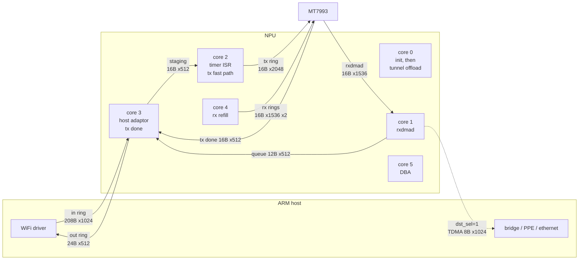
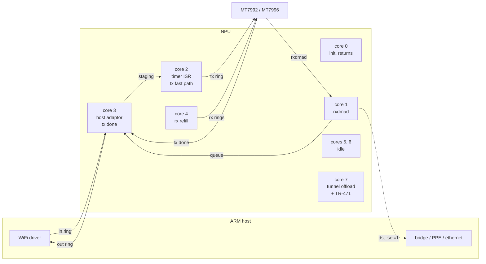
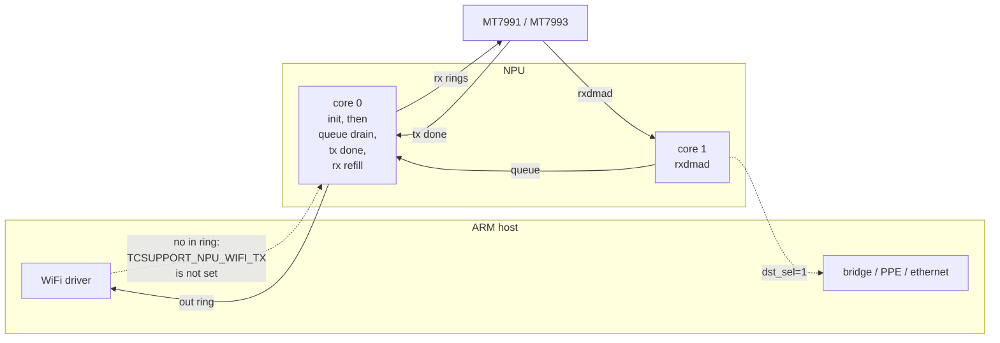

# Airoha AN75XX NPU Firmware

Bare-metal C firmware for the RISC-V packet-processing NPU embedded in
Airoha xPON-family SoCs (AN7552, AN7581, AN7583).

## Hardware

| SoC | Cores | WiFi Chips | Features |
|-----|------:|------------|----------|
| AN7552 | 2 | MT7916 MT7991 MT7993 | Base HWNAT offload |
| AN7581 | 8 | MT7916 MT7992 MT7996 | + tunnel offload, TR-471 (with WiFi) |
| AN7583 | 6 | MT7916 MT7992 MT7993 MT7996 NOWIFI | + tunnel offload, DBA/GPON (with WiFi) |

The NPU is a bare-metal RV32IMC cluster with no OS, no MMU. Each hart runs
a tight polling loop processing packets from the host kernel driver.

**Core assignment (AN7581 with an eagle chip):**
- Core 0: SRAM and ring init, then returns
- Core 1: rxdmad ring
- Core 2: timer ISR, then the WiFi tx ring
- Core 3: host adaptor both ways, tx done ring
- Core 4: rx ring refill
- Core 5: WiFi bridge loop
- Core 6: nothing
- Core 7: tunnel offload, and TR-471 init

`core_dispatch()` in `npu_main.c` is the whole map. The Core map and
data flow section below has one diagram per SoC.

### Memory Map

```
0x0C000000  PLIC (192 sources, 1-based HW IDs)
0x1EC00000  NPU thread manager / SCU / HW mutex / mailbox / MIB
0x1EC0D100  Host adaptor (DMA ring descriptors)
0x1FB50000  TDMA engine + PPE filter registers
0x1FBF0000  UART
0x3E800000  SRAM (AN7552=256KB, AN7581=480KB, AN7583=512KB, single-cycle)
0x84000000  DRAM (firmware code, loaded by kernel driver)
```

The NPU sees host physical addresses offset by +0x20000000 for SRAM and
ORed with 0x40000000 for DRAM DMA addresses.

### Clock

PLL register at 0x1FA201FC. bits[2:0]+1 is the divider; the frequency
selector differs per SoC:

| SoC | Selector | Table (MHz) |
|-----|----------|-------------|
| AN7552, AN7581 | bits[7:6] | 800, 750, 720, 600 |
| AN7583 | bits[8:7] | 666, 800, 720, 600 |

### Boot Reset Sequence

Hart 0 runs this once, gated by `npu_reset_pending` (set to 1 in
`.data`, cleared on the first pass). Secondary harts wait 10ms, then
poll `core_sync_flag` every 100ms until hart 0 sets it.

```
MIB21 (0x1EC0C194) saved            printf gate, lost across the reset
sim_mode_flag = MIB12 (0x1EC0C170)
RSTCTRL1 (0x1EC11834) = 0x10001788  assert reset on the NPU internal bus
delay 1ms
RSTCTRL1 = 0                        release
delay 1ms
THREAD_ENABLE (0x1EC00F00) = 4, 1
delay 1ms
MIB0 (0x1EC0C140) = 0xFFFFFFFF
boot UART init (0x1EC10000)
MIB21 restored
"core freq at %d MHz"
```

RSTCTRL1 is at SCU+0x834. SCU+0x000 is not the reset control; writing
it leaves the hart stuck on its next MMIO access, with no UART output
and every host mailbox call timing out.

### Hardware Mutex

Block at 0x1EC03000. A descriptor is two words — the mutex id and a
priority flag.

```
off  = (id * 4) & mask      mask 0x3C on AN7552/AN7583 (16 mutexes)
                            mask 0x7C on AN7581 (32 mutexes)
0x000 + hart*0x400 + off    status: bit16 held, bits[15:8] owner hart
0x080 + off                 priority acquire, write (hart<<8)|0x10040
0x180 + off                 acquire, write (hart<<8)|0x40
0x200 + hart*0x400 + off    release, write hart<<8
```

The hart field is 2 bits, so harts 4-7 alias onto 0-3. Acquire is a
single write plus one status read — the hardware arbitrates and callers
never spin. Mutex 15 is the printf lock.

Acquiring a mutex that is already held stalls the NPU bus: the acquire
write never completes, the store buffer fills, and the hart freezes a
few instructions later. Nothing may re-enter a printf while it holds the
printf mutex, which is why the trap handler reports faults instead of
dispatching them through the PLIC ISR table.

### WiFi Mail

Command handlers reach the host over mailbox function 0. `interfaceID`
in the message header means a band on the kite path and a **ring index**
on the eagle path:

| ring | eagle meaning |
|-----:|---------------|
| 0, 1 | RRO rx rings |
| 5, 6 | MSDU page rings |
| 8, 9 | indirect command ring |
| 10, 11 | tx done rings |
| 15 | all bases set; publish every ring's cpu index |

Host addresses at or above `0xC0000000` are outside the window the NPU
can reach. Both paths use the same dispatch tables, one entry per funcId,
with a different handler set behind each.

### Mailbox

`0x1EC0C000`, matching the host driver's `CR_MBOX_*` / `CR_MBQ<n>_CTRL*`.

```
+0x000               interrupt status (write 1 to clear)
+0x004 + n*4         interrupt mask n; mask n+1 = 1<<n routes mailbox n+1 to core n
+0x030 + q*0x10      CTRL0 buffer physical address     (q = core id)
+0x034 + q*0x10      CTRL1 length          (16-bit)
+0x038 + q*0x10      CTRL2 doorbell counter, incremented by the sender
+0x03C + q*0x10      CTRL3 arg + status    (16-bit: bit0 wait, bit1 done,
                                            bits[4:2] return, bits[14:11] func id)
+0x140 + n*4         MIB n
```

Queue 8 is the NPU-to-host notify channel. The notify mutex id is 14 on
AN7552 and AN7583, 30 on AN7581.

### PLIC

192 sources, hardware ids are source+1.

```
0x0C000004 + src*4   priority (16 for every source, 17 for source 95)
0x0C002000 + w*4     enable
0x0C003000 + w*4     mask / pending
0x0C200000           threshold
0x0C200004           claim and complete
```

### TDMA

The TDMA WiFi path exists only where `HAS_BME` does - AN7552 and AN7583
with a WiFi chip. AN7581 has no `tdma_tx_init`, `tdma_rx_init` or
`tdma_bme_init` on any of its three WiFi variants, and AN7583_NOWIFI
has no TDMA ring registers at all.

Within that path the per-variant differences are:

| what | AN7552 / AN7583 |
|------|-----------------|
| TX rings | 2, base 0x1FB50800, stride 0x10 |
| RX rings | 2, base 0x1FB50900, 1024 descriptors of 32 bytes |
| descriptor pattern | `(d & 0x3FFFC000) \| 0xC0000800` |
| flow control | runtime chip id check, AN7552 takes 0x1FB501BC |

`TDMA_WIFI_BUF_CFG` at 0x1FB50FE8 is the one field that splits by WiFi
chip rather than SoC:

| WiFi | write |
|------|-------|
| eagle (MT7991/7992/7993) | `(x & 0xFFB300FF) \| 0x190100` |
| kite (MT7916/7996) | `(x & 0xFFF300FF) \| 0x590100` |

`tdma_set_tx_ring_to_int` writes `0x01010101`/`1` for ring 0 and
`0x02020202`/`0x11` for ring 1, then reads both registers back to log
them. The read-back differs from what was written - the hardware does
not keep bit 0 of 0x1FB50A28 - so a log showing `=0` and `=10` is
correct.

### Timers

`NPU_TIMER0_BASE` is `0x1EC10100` and `NPU_TIMER1_BASE` `0x1EC10200`; the
CPU timer block is at `0x1EC10900`. AN7581 has 4 timers, AN7552 has 8 and
AN7583 has 16 across the two banks. Five `.data` tables index them: PLIC
source, interrupt-clear bit, enable bit, counter register and reload
register. The reload value is `50000 * period` on AN7583,
`1000 * period * clk` on AN7552 and `1000 * period * clk / 100` on AN7581.

The ISR acks by rewriting the control word as
`(ctrl & 0x1E0001EF) | (1 << clear_bit)`.

## Build

Requires `riscv64-unknown-elf-gcc` (tested with GCC 14.2.0 on Debian).

```sh
make SOC=AN7581 WIFI=MT7916       # one variant
make all-variants                  # all available variants
make SOC=AN7583 WIFI=MT7996 disasm # disassemble
```

Default: `SOC=AN7583 WIFI=MT7996`.

Outputs per variant in `build/<SOC>_<WIFI>/`:
- `npu_rv32.bin`: code + rodata, loaded to DRAM at 0x84000000
- `npu_data.bin`: initialized data, loaded to SRAM at 0x3E900000
- `firmware.map`: linker map
- `firmware.elf`: full ELF (for `nm`, `objdump`, etc.)

Compiler flags: `-Os -ffunction-sections -fdata-sections`
Linker flags: `--gc-sections --relax` + libgcc (for 64-bit division on RV32)

## Source Layout

One file per subsystem. A file named for a chip family holds only that
family's code, behind the matching `#ifdef`.

**Core**

| File | Lines | Purpose |
|------|------:|---------|
| `npu_globals.c` | 656 | Every shared global, in the order that fixes `npu_data.bin` |
| `npu_main.c` | 421 | Chip id, per-core entry points, core dispatch, trap vector, `npu_init` |
| `npu_util.c` | 59 | memset, memcpy, strlen, core id character |
| `npu_mutex.c` | 62 | Hardware mutex at 0x1EC03000 |
| `npu_plic.c` | 125 | Interrupt controller, 192 sources |
| `npu_timer.c` | 233 | Timers, CPU clock, delays |
| `npu_mbox.c` | 158 | Mailbox dispatch and host notify |
| `npu_sram.c` | 203 | SRAM bump allocator |
| `npu_bridge.c` | 111 | NPU bridge DMA channels |
| `npu_printf.c` | 384 | vsprintf, UART output, debug console |
| `npu_dba.c` | 105 | GPON bandwidth allocation, AN7583 |
| `npu_tr471.c` | 25 | TR-471 measurement, AN7581 |

**Tunnel offload** (AN758X)

| File | Lines | Purpose |
|------|------:|---------|
| `npu_tunnel.c` | 730 | Mail dispatch, offload handler, fragmentation, reassembly, SRv6 |
| `npu_ppe.c` | 824 | Chip capability table, PPE and GDM programming, HWNAT mail |
| `npu_l4s.c` | 148 | ECN congestion marking |

**WiFi offload**

| File | Lines | Purpose |
|------|------:|---------|
| `npu_wifi.c` | 198 | Mail dispatch, core 0 and core 3 init wrappers, debug counter ISR |
| `npu_wifi_bufid.c` | 326 | Rx buffer ids, tx tokens, debug counter blocks |
| `npu_tdma.c` | 396 | TDMA rings, BME, BMGR, DMA copy engine |
| `npu_hostadpt.c` | 177 | Host adaptor in and out rings |
| `npu_wifi_fwd.c` | 538 | piNode and rxNode forwarding, kite drain loops |
| `npu_wifi_ba.c` | 744 | Reorder nodes and the block ack window, kite |
| `npu_wifi_rx.c` | 1088 | Classifier, multi-descriptor handler, rx and tx processing |
| `npu_wifi_init.c` | 762 | Ring and table setup, host parameter setters |
| `npu_wifi_kite.c` | 565 | MT7916 and MT7996 mailbox handlers |
| `npu_wifi_eagle.c` | 935 | MT799x mailbox handlers and ring setup |
| `npu_wifi_eagle_dp.c` | 940 | MT799x datapath, the loops cores 1 to 4 run |

**Headers and build**

| File | Lines | Purpose |
|------|------:|---------|
| `npu_internal.h` | 577 | Cross-subsystem prototypes and extern declarations |
| `npu_wifi.h` | 242 | Shared between the WiFi files only |
| `npu_config.h` | 74 | `#ifdef` variant selection |
| `npu_regs.h` | 273 | MMIO register definitions |
| `npu_types.h` | 58 | `u8`/`u16`/`u32`/`u64`/`s32` typedefs, CSR access |
| `crt0.S` | 137 | Reset vector, BSS clear, stack setup, per-hart dispatch |
| `link.ld` | 71 | Linker script (DRAM + SRAM regions) |
| `Makefile` | 79 | Build system with all 11 variants |

All compile-time variants are handled with `#ifdef` across the source
files. Convention: `AN75XX` = all three SoCs, `AN758X` = AN7581 + AN7583.

### Conditional Feature Flags

| Flag | Condition | Enables |
|------|-----------|---------|
| `WIFI_KITE` | MT7916 / MT7996 | TDMA RX path, WiFi chip name table, function dispatch tables |
| `WIFI_EAGLE` | MT7991 / MT7992 / MT7993 | RRO, MSDU page ring, indirect command ring |
| `HAS_WIFI` | any WiFi chip | WiFi bridge, mailbox handlers and dispatch tables, BA reorder |
| `HAS_TUNNEL` | AN758X | Tunnel offload (IPv4/IPv6/SRv6), L4S ECN |
| `HAS_DBA` | AN7583 + WiFi | GPON DBA (dynamic bandwidth allocation) |
| `HAS_TR471` | AN7581 + WiFi | TR-471 latency/loss measurement |

## Binary Separation: npu_rv32.bin vs npu_data.bin

The firmware produces two binaries because they target different memory:

**npu_rv32.bin** (code + rodata → DRAM): Read-mostly, fetched through
instruction cache. Sits in host DDR, large but higher latency from the
NPU's perspective.

**npu_data.bin** (initialized globals → SRAM): Mutable working data the
NPU reads/writes every packet. SRAM is NPU-local with single-cycle
access, function pointer tables, lookup arrays, configuration state all
live here for performance.

The kernel driver loads each to its respective address. BSS follows
.data in SRAM and is zeroed by `crt0.S`. Stacks are placed in DRAM
after .text (16KB per hart).

## Kernel Driver Interface

The NPU firmware communicates with the Linux kernel driver
(`airoha_npu.ko`) via:

- **Mailbox** at 0x1EC0C000: 6 function slots (WiFi, tunnel, notify,
  DBA, TR-471, HWNAT). Each message carries an interfaceID, funcType
  (SET_WAIT/SET_NO_WAIT/GET_WAIT/GET_NO_WAIT), funcId, and data payload.
- **MIB registers** at 0x1EC0C140: Parameter passing (PCIe addresses,
  SRAM buffer pointers, init handshake).
- **Host adaptor rings** at 0x1EC0D100: DMA descriptor rings for packet
  transfer between host and NPU.

## Implementation Status

The object files across all 11 variants carry 257 distinct functions.
After `--gc-sections` a variant links only what its core entry points
reach: 175 functions and 34.6 KB for AN7583_MT7916 and AN7583_MT7996,
down to 69 functions and 16.2 KB for AN7583_NOWIFI.

### What's Implemented

- Full boot sequence (crt0 → per-hart dispatch → core0/core7 init)
- WiFi bridge TX/RX loop (kite) and the eagle datapath on cores 1-4
- WiFi mailbox handlers (SET_WAIT: 31 commands, GET_WAIT: 10 commands)
- Packet classifier and multi-descriptor handler
- BA (block-ack) reorder engine
- SRAM free-buffer ring (5600 entries of u16 buffer indices)
- Tunnel offload (store header, SRv6, fragmentation MTU, reset)
- PPE filter/enable configuration
- L4S ECN marking
- DBA subsystem (GPON bandwidth allocation)
- HW mutex (SCU spinlock) acquire/release
- npu_printf with %d/%u/%x/%s/%llu/%lld/%llx and width/pad support
- CPU clock readout, delay_us/delay_ms, timer tick counters
- Timer extensions: watchdog, multi-bank (AN7581), CPU timer init
- UART debug console

### Eagle datapath

Five rings and two buffer pools carry traffic between the host, the NPU
and the WiFi chip.

| ring | where | entry | who fills it |
|------|-------|-------|--------------|
| rxdmad (`ind_cmd`) | PCIe descriptor block + `0xE0A0` | 16 B | WiFi chip |
| rx ring 0/1 | PCIe descriptor block + `0`/`0x140A0` | 16 B | core 4 |
| tx done | `npu_set_rx_ring_for_tx_done_phy_base` | 16 B | WiFi chip |
| host adaptor in 0/1 | `0x1EC0D0A0` / `0x1EC0D0B0` | 208 B | host |
| host adaptor out 0/1 | `0x1EC0D180` / `0x1EC0D190` | 24 B | core 3 |
| WiFi tx 0/1 | PCIe descriptor block + `0x6020`/`0x1A0C0` | 16 B | core 2 |

Buffer pools: 12288 rx buffer ids over the WiFi packet buffer (2 KB per
id, 192 B headroom), and 13312 tx tokens over the NPU tx packet buffer.
A tx token is returned by the tx done ring, an rx buffer id by whoever
finishes with the frame.

Cores:

| core | worker | what it does |
|-----:|--------|--------------|
| 1 | `eagle_rxdmad_loop` | one rxdmad descriptor at a time; chains the segments of a frame that spans several rx buffers and queues it |
| 2 | `eagle_tx_fast_path` | staged frames into the WiFi tx ring, paced by the ring's own dma index |
| 3 | `eagle_core3_loop` | host adaptor in ring -> staging, packet queue -> host adaptor out ring, and the tx done ring |
| 4 | `eagle_rx_refill_loop` | refills both rx rings |

Nothing starts until the host sends
`WIFI_MAIL_API_SET_WAIT_INODE_TXRX_REG_ADDR`: case 2 raises the rx
flags, case 7 the tx flags, case 4 stops both. Cases 0, 1 and 3 carry
the RRO address element tables (128 of them, 64 KB each, 8 sessions per
table) and the particular session table.

The descriptor own bit is bit 31 of word 1 and means the NPU owns the
slot. A refill hands a slot back by writing `0x07000000`; a tx ring push
hands one over by writing `0x4C4048`. The WiFi tx rings start with every
descriptor at `0x80000000`, written when the host asks for their base.

The rxdmad ring has no own bit. Each descriptor carries a 4-bit
generation in the top nibble of word 3 (word 1 on the 8-byte indirect
command ring) that the chip increments each time it wraps, and the NPU
holds a counter of its own. Ring init stamps every descriptor with a
generation the NPU never expects - `0xF`, or `0xE` on the narrow ring -
so an untouched ring reads as empty.

`SET_WAIT_PCIE_PORT_TYPE` opens each PCIe port's inbound window onto the
descriptor block - a base at `0x1FA90038` / `0x1FC28030` and an end four
bytes after it, both physical. The rings live in NPU SRAM, so until the
window is open the WiFi chip cannot fetch a tx descriptor or write an rx
one: the NPU can queue as many as it likes and the chip's dma index
never moves. Types 0 and 1 give one port the whole block; 2 and 3 split
it, band 0 taking everything below rx ring 1 and band 1 the rest.

`npu_mbox_get_wait_rxdesc_base` is the pivot of ring setup: the host
programs the WiFi hardware from what it answers, so the answer is a
physical address (`& 0x1FFFFFFF`), and it is per ring id, not per band:

| id | answers with |
|---:|---|
| 0, 1 | rx ring descriptor base |
| 5, 6 | WiFi tx ring base, and arms that ring |
| 8, 9 | rxdmad / indirect command ring base |
| 10 | MSDU page ring base |

### Core map and data flow

Three SoCs, three core counts, the same datapath spread differently. The
eagle configuration is shown; kite differences are in the matrix below.

**AN7583 - six cores**



**AN7581 - eight cores**



**AN7552 - two cores**



### Per-variant matrix

| | AN7552 | AN7581 | AN7583 |
|---|---|---|---|
| cores | 2 | 8 | 6 |
| timers | 8 | 4 | 16 |
| `HAS_BME` | yes | no | yes |
| `HAS_TUNNEL` | no | core 7 | core 0 |
| `HAS_TR471` | no | yes | no |
| `HAS_DBA` | no | no | core 5 |
| `HAS_NPU_WIFI_TX` | no | not MT7916 | eagle only |
| host ring copy cap | 1792 / 3500 | 1792 | 1792 / 3500 |
| tunnel offload core | none built | 7 | 0 |

| | kite (MT7916, MT7996) | eagle (MT7991/2/3) |
|---|---|---|
| rx path | rxnode / pinode drain, BA reorder in the NPU | rxdmad ring, reorder in the WiFi chip |
| core 3 | drains both bands' nodes | host adaptor and tx done |
| core 4 | idle | rx ring refill |
| buffer ids | hardware allocator | 12288-entry software pool |
| BME | started | never started |

### SRAM allocation order

`sram_buf_alloc(type)` is a bump allocator over 0x3E800000, keyed by
address type, and `tdma_init` restarts it after zeroing all of SRAM.
Nothing may claim a block before that call. Core 0's order is:

| | |
|---|---|
| `tdma_init` | zero SRAM, reset the allocator |
| `bufid_pool_init` | types 138, 18, 28, 29 - 0x14000 |
| `core0_wifi_init_wrapper` | type 1, the PCIe descriptor block - 0x220C0 at 0x3E814000 |
| `npu_bridge_buf_init` | type 129, the bridge packet buffer |

The PCIe descriptor block holds every WiFi ring the host programs, at
the fixed offsets `eagle_ring_desc_base` carries, so it has to be a
single 0x220C0 reservation that nothing else overlaps.

### Per-variant differences

| | AN7552 | AN7581 | AN7583 |
|---|---|---|---|
| cores | 2 | 8 | 6 |
| eagle rxdmad | core 1 | core 1 | core 1 |
| eagle refill / queue drain | core 0 | cores 3-4 | cores 3-4 |
| host -> NPU tx ring | no | MT7992/MT7996 | eagle only |
| host ring copy limit | 1792 (eagle) / 3500 | 1792 | 1792 (eagle) / 3500 |
| TDMA flow control CRs | single gate | pause pair | single gate |

`HAS_NPU_WIFI_TX` selects the host -> NPU tx ring. AN7552 builds print
`TCSUPPORT_NPU_WIFI_TX is not set` and have no in ring at all; on
AN7552 core 0 carries the refill and tx done work that the larger parts
give to cores 3 and 4.

### What's Missing

- **WiFi -> LAN hardware fast path** a frame the WiFi chip marks
  `dst_sel=1` carries its own ethernet header offset, so the NPU can put
  it straight on the wired side and let the PPE forward it. `HWFAST=1`
  builds that; the default hands those frames to the host, which is what
  the driver's own rx path does with the same descriptor. The offload
  only works with `PPE_TB_CFG.SEARCH_MISS = 3`, otherwise the PPE drops
  every packet whose flow it cannot find instead of sending it to the
  CPU, and a DHCP discover leaves the chip and never comes back.
- **LAN -> WiFi hardware fast path** `sub_84006944` drains the TDMA
  rx ring straight into the WiFi tx ring through `sub_840146E2`. Not
  implemented; those frames take the host path instead.
- **TR-471** test infrastructure (~22 functions) is latency/loss
  measurement per ITU-T Y.1540
- **Thread manager** (~10 functions) advanced multi-hart scheduling
- **TDMA TX-done / RX fast-path** (~9 functions) TX completion
  callbacks, optimized RX
- **PPE filter tables** (~5 functions) full filter programming
- **Timer extensions** (~5 functions) watchdog, periodic callbacks
- **Trap vector** full 32-GPR context save/restore (current crt0 has
  a minimal trap handler)
- **Pre-computed .data tables** BA session SRAM pointer table (~2KB),
  tunnel template headers, TR-471 config structs, MIB address arrays.
  Current .data is 488 bytes (AN7583_MT7993), which is the three
  function-pointer tables and the five timer tables; the rest are not
  yet populated.
- **Boot UART RX console** `uart_debug_cmd` parses `rd`/`wt`, but no
  ISR is registered on PLIC source 22, which `npu_init` enables.

## Verification

Build all variants and check the outputs:

```sh
# build and check sizes
make all-variants
for v in build/*/; do
  echo "$(basename $v): code=$(wc -c < $v/npu_rv32.bin) data=$(wc -c < $v/npu_data.bin)"
done

# disassemble for offline analysis
make SOC=AN7581 WIFI=MT7916 disasm
```

`firmware.map` lists every symbol address for each variant.
