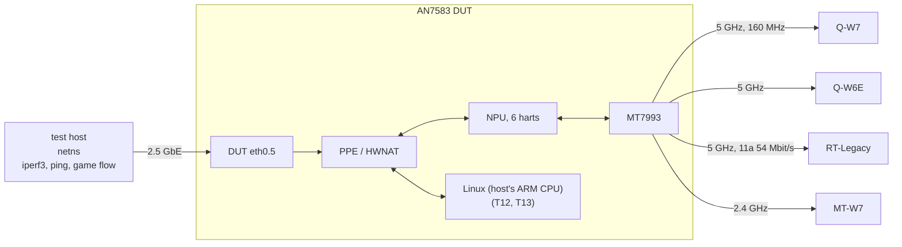
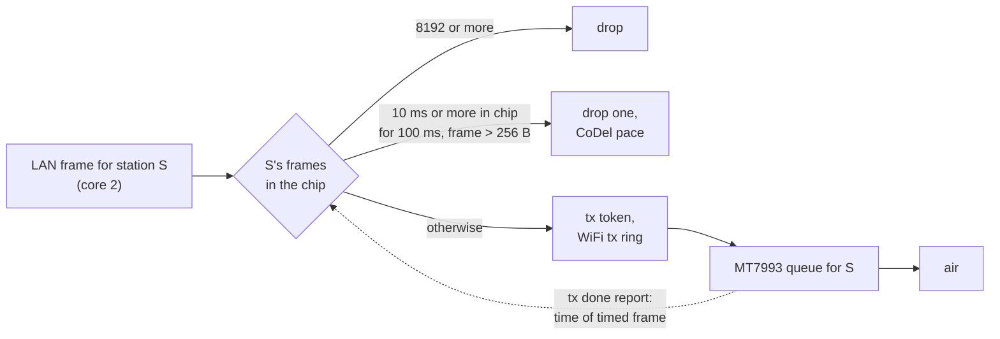

# Benchmark: AN7583 + MT7993, Stock NPU vs. Custom NPU

Simulated load using commit `f14ebfd`, large frames evaluated with additional jumbo buffer patches.

This firmware maintains full throughput to fast clients while eliminating the bulk of queueing delays introduced by the Wi-Fi chip for all other clients.

### Client Abbreviations

* **Q-W7 (PC):** Wi-Fi 7 5GHz Qualcomm PCIe station

* **Q-W6E (Laptop):** Wi-Fi 6E 5GHz Qualcomm PCIe station

* **MT-W7 (2.4 GHz Laptop):** Wi-Fi 7 2.4GHz Mediatek USB station

* **RT-Legacy (Slow Client):** Wi-Fi 7 2.4GHz Realtek USB station configured to be on legacy mode

## Summary

* **Gaming and calls during downloads:** A game-like flow (100-byte UDP every 20 ms) directed to a client actively downloading experiences **20 to 31 ms** of latency instead of **94 to 131 ms** at 2.4 GHz (MT-W7), reducing packet loss from **23–37%** down to **0–1.5%**. On Q-W6E sharing 5 GHz with Q-W7, latency drops from **61 ms to 15 ms**, eliminating a **13%** packet loss.

* **Slow devices:** RT-Legacy (54 Mbit/s, no aggregation, mimicking legacy/IoT gear) maintains throughput with a TCP RTT of **38 ms** instead of **500 ms**. Concurrently, Q-W7 on the same radio sees its throughput increase from **951 to 1204 Mbit/s (+27%)**.

* **Multi-device saturation:** With four active downloading clients across both bands, queueing latency across all clients drops by **40% to 86%**, while Q-W7's bandwidth share rises from **651 to 995 Mbit/s**.

* **Large frames:** Bumping the WLAN MTU to 2304 allows local DUT-to-client TCP traffic to reach **550 Mbit/s** (compared to stock's broken allocation lead to corrupted frames **147 Mbit/s**). Stock firmware overwrites adjacent tx buffers for frames over 2 KB, corrupting queue state ([Large frames](#large-frames)).

* **Unchanged metrics:** Single-client peak performance on Q-W7 (1.55 Gbit/s down, 1.2 Gbit/s at MSS 536, 1.79 Gbit/s UDP), 20 ms WAN RTT, overall packet rates, local Wi-Fi traffic to/from the DUT CPU at 5 GHz, and chained rx frame handling.

* **Trade-offs:** Under direct airtime contention with a fast client, RT-Legacy receives a smaller share of the channel (**5.6 Mbit/s** vs. **10.3 Mbit/s** alongside Q-W7). Dual fast clients on a single radio retained aggregate throughput (1491 vs 1492 Mbit/s), with parameter sweeps showing marginal variance (2% to 6%).

Performance gains stem from a reworked per-station queue limit that bounds chip residence time rather than raw frame count ([sta-qlimit.md](sta-qlimit.md)). Large-frame fixes utilize reserved buffer pairs for outgoing frames exceeding 2 KB. Additionally, reading tx done reports via D-cache cache-line invalidation saves core 3 roughly 25% of its cycles without impacting baseline throughput.

## Test Setup

| Item | Detail | 
 | ----- | ----- | 
| **DUT** | AN7583 + MT7993 (Wi-Fi 7, 2.4 + 5 GHz), OpenWrt, Linux kernel 5.4, bridge mode | 
| **Radios** | 2.4 GHz channel 6, EHT40, WPA2/3; 5 GHz channel 36, 160 MHz, EHT160, WPA2/3 | 
| **Stock NPU** | Stock NPU firmware `TLB7.8.0.0_v003` | 
| **Custom NPU** | `f14ebfd`; queue limit defaults (delay 10 ms, small 256 B, limit 8192). Large frame tests include jumbo tx buffer modifications | 
| **Q-W7** | Wi-Fi 7 5GHz Qualcomm PCIe station (Linux, 2x2 EHT 160 MHz, MLO, power save off) | 
| **Q-W6E** | Wi-Fi 6E 5GHz Qualcomm PCIe station (Linux, 2x2 HE-MCS 11 160 MHz, power save off) | 
| **MT-W7** | Wi-Fi 7 2.4GHz Mediatek USB station (Linux) | 
| **RT-Legacy** | Wi-Fi 7 2.4GHz Realtek USB station configured to be on legacy mode (802.11a on 5 GHz BSS, 54 Mbit/s, no aggregation, -28 dBm) | 
| **Wired side** | Test host 2.5 GbE port on DUT `eth0.5`, isolated netns, iperf3 3.18, DHCP | 

All wireless clients is ~1m away from the AP, in a relatively quiet RF environment.

### Methodology

* Every client runs an iperf3 server and a custom UDP echo service to simulate game traffics.

* **Game flow:** 100-byte UDP packets every 20 ms (DSCP 0) sent from the wired side and echoed by the client. HWNAT offloads this flow, causing it to queue alongside concurrent download streams in the Wi-Fi chip. Latency reflects RTT (p50, p99); loss tracks unreturned echoes. A **stream** refers to 1200-byte packets every 2 ms (4.8 Mbit/s, simulating 1080p streaming).

* Ping (ICMP from wired side) bypasses HWNAT offload, traversing the host CPU path, and thus under-reports chip queue depth. Included for continuity.

* TCP runs for 15s across 4 streams unless specified; UDP runs for 10s. 5s stabilization period between runs.

* 6 matrix rounds per firmware per boot, plus top-up rounds 7–9 for S5, S6, and S9. Cells display mean values over 5 validated runs ± standard deviation.

* Statistically significant changes ($\ge 5\%$ magnitude and $> 2\times$ standard error) are noted in **bold**.

## Test Matrix

| Scenario | Active Clients | 
 | ----- | ----- | 
| **S1** | MT-W7 alone | 
| **S2** | Q-W7 alone | 
| **S3** | Q-W7 + Q-W6E (5 GHz) | 
| **S4** | Q-W7 (5 GHz) + MT-W7 (2.4 GHz) | 
| **S5** | Q-W7 + Q-W6E + MT-W7 downloading concurrently | 
| **S6** | Q-W7 active game flow while Q-W6E and MT-W7 download | 
| **S7** | Q-W7 + RT-Legacy on 5 GHz | 
| **S8** | RT-Legacy alone | 
| **S9** | All four clients downloading concurrently | 
| **S10** | 60 Mbit/s background UDP to RT-Legacy while Q-W7 downloads | 

| Test ID | Traffic Profile | 
 | ----- | ----- | 
| **T1** | Idle: 100 pings + 10s game flow | 
| **T2** | TCP download (4 streams) + game flow + ping to same client | 
| **T3** | TCP download (1 stream) + game flow | 
| **T4** | TCP upload (4 streams) + game flow + ping | 
| **T5** | TCP download (MSS 536) | 
| **T6, T7, T8** | UDP download: 1472, 512, 64 B | 
| **T9, T10** | UDP upload: 1472, 64 B | 
| **T11** | TCP download (1 stream) + 20 ms WAN delay + game flow | 
| **T12, T13** | Local TCP traffic to/from DUT CPU | 
| **T14** | 2000B and 2200B pings from RT-Legacy to DUT CPU (chained RX) | 
| **T15, T16** | UDP download 1472 B and 64 B (4 senders) | 
| **T17** | TCP download (4 streams) + media stream + game flow | 
| **T18** | TCP download (MSS 88, 8 streams): maximum packet rate | 

## Results

### S1: MT-W7 (Wi-Fi 7 2.4GHz Mediatek USB)

| Test | Metric | Stock NPU | Custom NPU | Delta | 
 | ----- | ----- | ----- | ----- | ----- | 
| T1 idle ping | ms p50 | 1.8 ± 0.01 | 1.8 ± 0.01 | +1 % | 
| T1 idle ping | ms p99 | 11.9 ± 4.7 | 99.5 ± 53.3 | **+733 %** worse | 
| T1 idle ping | % loss | 0.00 ± 0.00 | 0.00 ± 0.00 | +0.0 pt | 
| T1 idle game flow | ms p50 | 1.0 ± 0.18 | 1.1 ± 0.04 | +4 % | 
| T1 idle game flow | ms p99 | 49.5 ± 57.1 | 47.5 ± 53.2 | \-4 % | 
| T1 idle game flow | % loss | 0.00 ± 0.00 | 0.00 ± 0.00 | +0.0 pt | 
| T2 TCP down x4 | Mb/s | 212 ± 19.0 | 192 ± 27.5 | \-9 % | 
| T2 TCP down x4 | ms RTT | 119 ± 92.9 | 32.3 ± 6.2 | **-73 %** better | 
| T2 TCP down x4 | retrans | 862 ± 876 | 192 ± 157 | \-78 % | 
| T2 game flow under download | ms p50 | 94.2 ± 70.6 | 30.7 ± 1.6 | **-67 %** better | 
| T2 game flow under download | ms p99 | 236 ± 118 | 160 ± 112 | \-32 % | 
| T2 game flow under download | % loss | 23.8 ± 29.6 | 0.75 ± 0.83 | \-23.1 pt | 
| T2 ping under download | ms p50 | 14.6 ± 1.9 | 12.6 ± 1.4 | \-14 % | 
| T2 ping under download | ms p99 | 99.5 ± 38.4 | 139 ± 123 | +40 % | 
| T3 TCP down x1 | Mb/s | 198 ± 27.0 | 210 ± 15.9 | +6 % | 
| T3 TCP down x1 | ms RTT | 171 ± 68.3 | 17.5 ± 1.0 | **-90 %** better | 
| T3 game flow under download | ms p50 | 131 ± 34.3 | 20.1 ± 2.1 | **-85 %** better | 
| T3 game flow under download | ms p99 | 489 ± 171 | 78.2 ± 40.7 | **-84 %** better | 
| T3 game flow under download | % loss | 37.1 ± 21.1 | 0.00 ± 0.00 | **-37.1 pt** better | 
| T4 TCP up x4 | Mb/s | 249 ± 23.5 | 216 ± 15.1 | **-13 %** worse | 
| T4 game flow under upload | ms p50 | 28.5 ± 1.2 | 29.7 ± 1.3 | +4 % | 
| T4 game flow under upload | ms p99 | 83.2 ± 39.7 | 158 ± 13.7 | **+90 %** worse | 
| T4 game flow under upload | % loss | 0.00 ± 0.00 | 0.00 ± 0.00 | +0.0 pt | 
| T4 ping under upload | ms p50 | 23.9 ± 0.83 | 24.8 ± 1.0 | +4 % | 
| T4 ping under upload | ms p99 | 61.7 ± 48.4 | 147 ± 14.6 | **+139 %** worse | 
| T5 TCP down MSS 536 | Mb/s | 158 ± 27.2 | 196 ± 7.6 | **+24 %** better | 
| T5 TCP down MSS 536 | ms RTT | 103 ± 36.0 | 25.6 ± 1.0 | **-75 %** better | 
| T6 UDP down 1472 B | Mb/s | 237 ± 7.0 | 179 ± 38.9 | **-25 %** worse | 
| T6 UDP down 1472 B | % loss | 39.5 ± 1.7 | 53.1 ± 10.0 | **+13.6 pt** worse | 
| T6 UDP down 1472 B | ms jitter | 0.09 ± 0.06 | 1.1 ± 2.3 | +0.98 | 
| T7 UDP down 512 B | Mb/s | 169 ± 21.4 | 190 ± 8.0 | **+13 %** better | 
| T7 UDP down 512 B | kpps | 41.2 ± 5.2 | 46.5 ± 2.0 | **+13 %** better | 
| T7 UDP down 512 B | % loss | 15.1 ± 10.3 | 4.7 ± 4.0 | **-10.4 pt** better | 
| T8 UDP down 64 B | kpps | 61.3 ± 7.9 | 62.9 ± 6.0 | +3 % | 
| T8 UDP down 64 B | % loss | 40.7 ± 7.6 | 39.1 ± 6.0 | \-1.6 pt | 
| T9 UDP up 1472 B | Mb/s | 283 ± 4.7 | 252 ± 40.1 | \-11 % | 
| T9 UDP up 1472 B | % loss | 0.00 ± 0.00 | 0.00 ± 0.00 | +0.0 pt | 
| T10 UDP up 64 B | kpps | 114 ± 1.6 | 115 ± 4.3 | +1 % | 
| T10 UDP up 64 B | % loss | 2.9 ± 1.5 | 1.7 ± 3.1 | \-1.2 pt | 
| T12 Wi-Fi to CPU | Mb/s | 162 ± 1.1 | 144 ± 9.7 | **-11 %** worse | 
| T13 CPU to Wi-Fi | Mb/s | 160 ± 18.2 | 200 ± 28.5 | **+25 %** better | 
| T16 UDP down 64 B, 4 streams | kpps | 220 ± 5.1 | 200 ± 58.2 | \-9 % | 
| T16 UDP down 64 B, 4 streams | % loss | 19.0 ± 1.3 | 25.9 ± 21.1 | +7.0 pt | 
| T17 TCP down x4 beside stream | Mb/s | 181 ± 12.4 | 203 ± 17.9 | **+12 %** better | 
| T17 TCP down x4 beside stream | ms RTT | 92.0 ± 138 | 34.4 ± 4.5 | \-63 % | 
| T17 4.8 Mbit/s stream | ms p50 | 51.7 ± 38.9 | 34.5 ± 1.6 | \-33 % | 
| T17 4.8 Mbit/s stream | ms p99 | 206 ± 94.5 | 125 ± 46.4 | \-39 % | 
| T17 4.8 Mbit/s stream | % loss | 16.0 ± 30.4 | 2.8 ± 1.5 | \-13.3 pt | 
| T17 game flow | ms p50 | 52.1 ± 40.2 | 34.6 ± 1.8 | \-34 % | 
| T17 game flow | ms p99 | 209 ± 97.2 | 123 ± 45.5 | \-41 % | 
| T17 game flow | % loss | 16.1 ± 30.4 | 1.2 ± 1.6 | \-14.9 pt | 
| T18 TCP down MSS 88, 8 streams | kpps | 152 ± 2.7 | 149 ± 12.0 | \-2 % | 
| T18 TCP down MSS 88, 8 streams | ms RTT | 52.8 ± 4.9 | 35.8 ± 10.9 | **-32 %** better | 

### S2: Q-W7 (Wi-Fi 7 5GHz Qualcomm PCIe)

| Test | Metric | Stock NPU | Custom NPU | Delta | 
 | ----- | ----- | ----- | ----- | ----- | 
| T1 idle ping | ms p50 | 5.6 ± 0.42 | 5.3 ± 0.48 | \-4 % | 
| T1 idle ping | ms p99 | 14.6 ± 1.3 | 16.3 ± 3.7 | +12 % | 
| T1 idle ping | % loss | 0.00 ± 0.00 | 0.00 ± 0.00 | +0.0 pt | 
| T1 idle game flow | ms p50 | 4.5 ± 0.05 | 4.4 ± 0.06 | \-1 % | 
| T1 idle game flow | ms p99 | 8.9 ± 1.7 | 8.0 ± 0.99 | \-10 % | 
| T1 idle game flow | % loss | 0.00 ± 0.00 | 0.00 ± 0.00 | +0.0 pt | 
| T2 TCP down x4 | Mb/s | 1538 ± 25.1 | 1545 ± 16.7 | +0 % | 
| T2 TCP down x4 | ms RTT | 15.3 ± 1.0 | 15.2 ± 0.60 | \-1 % | 
| T2 TCP down x4 | retrans | 1.2 ± 1.1 | 1.4 ± 2.1 | +17 % | 
| T2 game flow under download | ms p50 | 17.1 ± 0.32 | 16.9 ± 0.53 | \-1 % | 
| T2 game flow under download | ms p99 | 42.0 ± 4.6 | 39.2 ± 2.8 | \-7 % | 
| T2 game flow under download | % loss | 0.00 ± 0.00 | 0.00 ± 0.00 | +0.0 pt | 
| T2 ping under download | ms p50 | 16.3 ± 0.67 | 16.4 ± 0.94 | +0 % | 
| T2 ping under download | ms p99 | 37.1 ± 2.2 | 37.2 ± 2.9 | +0 % | 
| T3 TCP down x1 | Mb/s | 1199 ± 19.4 | 1178 ± 25.6 | \-2 % | 
| T3 TCP down x1 | ms RTT | 6.2 ± 0.35 | 6.0 ± 0.45 | \-3 % | 
| T3 game flow under download | ms p50 | 7.2 ± 0.47 | 7.3 ± 0.39 | +1 % | 
| T3 game flow under download | ms p99 | 18.4 ± 1.3 | 27.1 ± 21.7 | +48 % | 
| T3 game flow under download | % loss | 0.00 ± 0.00 | 0.00 ± 0.00 | +0.0 pt | 
| T4 TCP up x4 | Mb/s | 1512 ± 37.8 | 1431 ± 32.2 | **-5 %** worse | 
| T4 game flow under upload | ms p50 | 7.2 ± 0.23 | 6.2 ± 0.23 | **-14 %** better | 
| T4 game flow under upload | ms p99 | 21.1 ± 9.2 | 13.7 ± 1.9 | \-35 % | 
| T4 game flow under upload | % loss | 0.00 ± 0.00 | 0.11 ± 0.11 | +0.1 pt | 
| T4 ping under upload | ms p50 | 7.3 ± 0.16 | 6.4 ± 0.29 | **-12 %** better | 
| T4 ping under upload | ms p99 | 22.9 ± 13.0 | 17.2 ± 3.0 | \-25 % | 
| T5 TCP down MSS 536 | Mb/s | 1192 ± 29.7 | 1200 ± 37.3 | +1 % | 
| T5 TCP down MSS 536 | ms RTT | 7.6 ± 0.41 | 8.5 ± 1.4 | +13 % | 
| T6 UDP down 1472 B | Mb/s | 964 ± 192 | 1013 ± 93.4 | +5 % | 
| T6 UDP down 1472 B | % loss | 0.02 ± 0.01 | 0.03 ± 0.02 | +0.0 pt | 
| T6 UDP down 1472 B | ms jitter | 0.02 ± 0.02 | 0.03 ± 0.02 | +0.00 | 
| T7 UDP down 512 B | Mb/s | 396 ± 10.1 | 365 ± 76.1 | \-8 % | 
| T7 UDP down 512 B | kpps | 96.6 ± 2.5 | 89.2 ± 18.6 | \-8 % | 
| T7 UDP down 512 B | % loss | 0.02 ± 0.02 | 0.01 ± 0.02 | \-0.0 pt | 
| T8 UDP down 64 B | kpps | 93.4 ± 20.0 | 85.1 ± 24.4 | \-9 % | 
| T8 UDP down 64 B | % loss | 0.04 ± 0.02 | 0.05 ± 0.08 | +0.0 pt | 
| T9 UDP up 1472 B | Mb/s | 1197 ± 11.1 | 1190 ± 18.4 | \-1 % | 
| T9 UDP up 1472 B | % loss | 1.4 ± 0.59 | 1.9 ± 0.47 | +0.5 pt | 
| T10 UDP up 64 B | kpps | 196 ± 2.8 | 188 ± 3.0 | \-4 % | 
| T10 UDP up 64 B | % loss | 32.7 ± 0.93 | 35.7 ± 1.0 | **+3.0 pt** worse | 
| T12 Wi-Fi to CPU | Mb/s | 161 ± 2.3 | 162 ± 1.7 | +0 % | 
| T13 CPU to Wi-Fi | Mb/s | 461 ± 3.6 | 458 ± 2.6 | \-1 % | 
| T16 UDP down 64 B, 4 streams | kpps | 304 ± 10.6 | 309 ± 1.8 | +2 % | 
| T16 UDP down 64 B, 4 streams | % loss | 1.6 ± 3.4 | 0.07 ± 0.00 | \-1.5 pt | 
| T17 TCP down x4 beside stream | Mb/s | 1549 ± 5.2 | 1545 ± 8.2 | \-0 % | 
| T17 TCP down x4 beside stream | ms RTT | 16.5 ± 1.9 | 15.5 ± 1.2 | \-6 % | 
| T17 4.8 Mbit/s stream | ms p50 | 17.3 ± 0.38 | 17.6 ± 0.43 | +2 % | 
| T17 4.8 Mbit/s stream | ms p99 | 38.4 ± 0.80 | 38.4 ± 1.6 | +0 % | 
| T17 4.8 Mbit/s stream | % loss | 1.2 ± 2.7 | 0.03 ± 0.02 | \-1.2 pt | 
| T17 game flow | ms p50 | 16.7 ± 0.19 | 17.3 ± 0.68 | +3 % | 
| T17 game flow | ms p99 | 36.8 ± 1.4 | 38.4 ± 3.1 | +4 % | 
| T17 game flow | % loss | 1.2 ± 2.7 | 0.00 ± 0.00 | \-1.2 pt | 
| T18 TCP down MSS 88, 8 streams | kpps | 261 ± 10.1 | 275 ± 21.0 | +5 % | 
| T18 TCP down MSS 88, 8 streams | ms RTT | 24.0 ± 6.3 | 16.0 ± 5.2 | **-33 %** better | 
| T11 TCP down x1, +20 ms WAN | Mb/s | 303 ± 4.1 | 300 ± 8.6 | \-1 % | 
| T11 TCP down x1, +20 ms WAN | ms RTT | 26.4 ± 0.36 | 26.8 ± 0.45 | +1 % | 
| T11 game flow | ms p50 | 23.7 ± 0.07 | 23.7 ± 0.05 | +0 % | 
| T11 game flow | ms p99 | 37.7 ± 1.8 | 38.1 ± 1.5 | +1 % | 
| T11 game flow | % loss | 0.00 ± 0.00 | 0.00 ± 0.00 | +0.0 pt | 
| T11 ping under download | ms p50 | 23.8 ± 0.00 | 23.8 ± 0.00 | +0 % | 
| T11 ping under download | ms p99 | 39.7 ± 5.4 | 36.9 ± 1.9 | \-7 % | 
| T15 UDP down 1472 B, 4 streams | Mb/s | 1781 ± 20.2 | 1790 ± 16.2 | +1 % | 
| T15 UDP down 1472 B, 4 streams | kpps | 151 ± 1.7 | 152 ± 1.4 | +1 % | 
| T15 UDP down 1472 B, 4 streams | % loss | 13.1 ± 3.1 | 13.0 ± 3.1 | \-0.1 pt | 

### S3: Dual 5 GHz Clients (Q-W7 + Q-W6E)

| Test | Metric | Stock NPU | Custom NPU | Delta | 
 | ----- | ----- | ----- | ----- | ----- | 
| T2 TCP, Q-W7 | Mb/s | 684 ± 37.9 | 726 ± 75.4 | +6 % | 
| T2 TCP, Q-W7 | ms RTT | 35.3 ± 9.7 | 27.9 ± 2.2 | \-21 % | 
| T2 game flow, Q-W7 | ms p50 | 36.2 ± 1.2 | 29.4 ± 3.6 | **-19 %** better | 
| T2 game flow, Q-W7 | ms p99 | 151 ± 29.3 | 141 ± 33.9 | \-6 % | 
| T2 game flow, Q-W7 | % loss | 0.53 ± 0.91 | 0.00 ± 0.00 | \-0.5 pt | 
| T2 TCP, Q-W6E | Mb/s | 807 ± 66.0 | 766 ± 101 | \-5 % | 
| T2 TCP, Q-W6E | ms RTT | 61.7 ± 7.5 | 13.6 ± 2.2 | **-78 %** better | 
| T2 game flow, Q-W6E | ms p50 | 61.1 ± 4.9 | 15.1 ± 1.6 | **-75 %** better | 
| T2 game flow, Q-W6E | ms p99 | 172 ± 71.3 | 109 ± 33.7 | \-37 % | 
| T2 game flow, Q-W6E | % loss | 13.3 ± 6.9 | 0.00 ± 0.00 | **-13.3 pt** better | 
| T4 TCP, Q-W7 | Mb/s | 1187 ± 56.6 | 1005 ± 69.5 | **-15 %** worse | 
| T4 game flow, Q-W7 | ms p50 | 5.9 ± 0.26 | 5.0 ± 0.40 | **-15 %** better | 
| T4 game flow, Q-W7 | ms p99 | 13.9 ± 2.4 | 11.7 ± 2.3 | \-16 % | 
| T4 game flow, Q-W7 | % loss | 0.00 ± 0.00 | 0.21 ± 0.20 | +0.2 pt | 
| T4 TCP, Q-W6E | Mb/s | 238 ± 32.9 | 261 ± 23.3 | +10 % | 
| T4 game flow, Q-W6E | ms p50 | 21.5 ± 0.75 | 13.8 ± 3.4 | **-36 %** better | 
| T4 game flow, Q-W6E | ms p99 | 101 ± 63.2 | 45.6 ± 49.2 | \-55 % | 
| T4 game flow, Q-W6E | % loss | 0.00 ± 0.00 | 0.29 ± 0.11 | +0.3 pt | 
| T6 UDP down 1472 B, Q-W7 | Mb/s | 934 ± 144 | 915 ± 153 | \-2 % | 
| T6 UDP down 1472 B, Q-W7 | % loss | 0.02 ± 0.02 | 0.01 ± 0.01 | \-0.0 pt | 

### S4: Q-W7 (5 GHz) + MT-W7 (2.4 GHz)

| Test | Metric | Stock NPU | Custom NPU | Delta | 
 | ----- | ----- | ----- | ----- | ----- | 
| T2 TCP, Q-W7 | Mb/s | 1552 ± 31.3 | 1579 ± 13.2 | +2 % | 
| T2 TCP, Q-W7 | ms RTT | 15.8 ± 2.4 | 14.6 ± 1.4 | \-7 % | 
| T2 game flow, Q-W7 | ms p50 | 15.9 ± 0.41 | 16.0 ± 0.24 | +1 % | 
| T2 game flow, Q-W7 | ms p99 | 37.7 ± 3.1 | 36.9 ± 4.4 | \-2 % | 
| T2 game flow, Q-W7 | % loss | 0.00 ± 0.00 | 0.00 ± 0.00 | +0.0 pt | 
| T2 TCP, MT-W7 | Mb/s | 214 ± 22.6 | 183 ± 13.3 | **-15 %** worse | 
| T2 TCP, MT-W7 | ms RTT | 118 ± 77.7 | 28.2 ± 5.9 | **-76 %** better | 
| T2 game flow, MT-W7 | ms p50 | 113 ± 72.1 | 28.8 ± 2.1 | **-75 %** better | 
| T2 game flow, MT-W7 | ms p99 | 214 ± 37.2 | 167 ± 23.7 | **-22 %** better | 
| T2 game flow, MT-W7 | % loss | 23.3 ± 23.5 | 1.5 ± 1.2 | **-21.7 pt** better | 
| T4 TCP, Q-W7 | Mb/s | 1251 ± 20.7 | 1148 ± 26.6 | **-8 %** worse | 
| T4 game flow, Q-W7 | ms p50 | 4.9 ± 0.18 | 4.5 ± 0.12 | **-9 %** better | 
| T4 game flow, Q-W7 | ms p99 | 11.0 ± 1.4 | 9.1 ± 0.86 | **-18 %** better | 
| T4 game flow, Q-W7 | % loss | 0.00 ± 0.00 | 0.21 ± 0.12 | +0.2 pt | 
| T4 TCP, MT-W7 | Mb/s | 220 ± 26.1 | 232 ± 26.2 | +5 % | 
| T4 game flow, MT-W7 | ms p50 | 26.6 ± 2.9 | 13.0 ± 0.67 | **-51 %** better | 
| T4 game flow, MT-W7 | ms p99 | 129 ± 48.5 | 47.6 ± 52.6 | **-63 %** better | 
| T4 game flow, MT-W7 | % loss | 0.00 ± 0.00 | 0.24 ± 0.17 | +0.2 pt | 
| T6 UDP down 1472 B, Q-W7 | Mb/s | 845 ± 309 | 1059 ± 11.0 | +25 % | 
| T6 UDP down 1472 B, Q-W7 | % loss | 0.02 ± 0.02 | 0.08 ± 0.16 | +0.1 pt | 
| T6 UDP down 1472 B, MT-W7 | Mb/s | 234 ± 12.1 | 194 ± 42.8 | \-17 % | 
| T6 UDP down 1472 B, MT-W7 | % loss | 33.3 ± 6.5 | 44.0 ± 10.8 | +10.7 pt | 

### S5: Three Concurrent Fast Client Downloads

| Test | Metric | Stock NPU | Custom NPU | Delta | 
 | ----- | ----- | ----- | ----- | ----- | 
| T2 TCP, Q-W7 | Mb/s | 804 ± 388 | 855 ± 384 | +6 % | 
| T2 TCP, Q-W7 | ms RTT | 29.0 ± 8.4 | 26.7 ± 6.5 | \-8 % | 
| T2 game flow, Q-W7 | ms p50 | 29.5 ± 8.0 | 28.9 ± 8.2 | \-2 % | 
| T2 game flow, Q-W7 | ms p99 | 115 ± 38.2 | 140 ± 71.8 | +21 % | 
| T2 game flow, Q-W7 | % loss | 0.35 ± 0.70 | 0.00 ± 0.00 | \-0.3 pt | 
| T2 TCP, Q-W6E | Mb/s | 819 ± 53.6 | 801 ± 52.2 | \-2 % | 
| T2 TCP, Q-W6E | ms RTT | 95.2 ± 16.1 | 14.9 ± 2.7 | **-84 %** better | 
| T2 game flow, Q-W6E | ms p50 | 77.4 ± 33.1 | 15.6 ± 1.8 | **-80 %** better | 
| T2 game flow, Q-W6E | ms p99 | 188 ± 39.3 | 77.5 ± 48.1 | **-59 %** better | 
| T2 game flow, Q-W6E | % loss | 27.7 ± 18.5 | 0.00 ± 0.00 | **-27.7 pt** better | 
| T2 TCP, MT-W7 | Mb/s | 205 ± 40.8 | 225 ± 20.0 | +9 % | 
| T2 TCP, MT-W7 | ms RTT | 121 ± 98.8 | 23.3 ± 2.3 | **-81 %** better | 
| T2 game flow, MT-W7 | ms p50 | 9.0 ± 14.8 | 7.2 ± 12.1 | \-20 % | 
| T2 game flow, MT-W7 | ms p99 | 114 ± 65.9 | 55.8 ± 47.6 | \-51 % | 
| T2 game flow, MT-W7 | % loss | 0.29 ± 0.51 | 0.00 ± 0.00 | \-0.3 pt | 

### S6: Q-W7 Active Gaming during Dual Downloads

| Test | Metric | Stock NPU | Custom NPU | Delta | 
 | ----- | ----- | ----- | ----- | ----- | 
| T2 game flow, Q-W7 (idle) | ms p50 | 27.0 ± 0.39 | 25.3 ± 1.9 | **-6 %** better | 
| T2 game flow, Q-W7 (idle) | ms p99 | 246 ± 16.2 | 220 ± 20.2 | **-11 %** better | 
| T2 game flow, Q-W7 (idle) | % loss | 0.00 ± 0.00 | 0.00 ± 0.00 | +0.0 pt | 
| T2 TCP, Q-W6E | Mb/s | 1329 ± 118 | 1209 ± 146 | \-9 % | 
| T2 TCP, Q-W6E | ms RTT | 55.7 ± 7.6 | 12.7 ± 2.7 | **-77 %** better | 
| T2 TCP, MT-W7 | Mb/s | 193 ± 8.8 | 258 ± 2.4 | **+34 %** better | 
| T2 TCP, MT-W7 | ms RTT | 141 ± 80.8 | 24.8 ± 2.9 | **-82 %** better | 

### S7: Q-W7 + RT-Legacy Co-existing on 5 GHz

| Test | Metric | Stock NPU | Custom NPU | Delta | 
 | ----- | ----- | ----- | ----- | ----- | 
| T2 TCP, Q-W7 | Mb/s | 951 ± 21.8 | 1204 ± 18.5 | **+27 %** better | 
| T2 TCP, Q-W7 | ms RTT | 30.6 ± 2.8 | 25.1 ± 9.0 | \-18 % | 
| T2 game flow, Q-W7 | ms p50 | 30.0 ± 2.1 | 21.6 ± 0.87 | **-28 %** better | 
| T2 game flow, Q-W7 | ms p99 | 149 ± 42.2 | 103 ± 28.7 | **-31 %** better | 
| T2 game flow, Q-W7 | % loss | 1.4 ± 0.92 | 0.00 ± 0.00 | **-1.4 pt** better | 
| T2 TCP, RT-Legacy | Mb/s | 10.3 ± 0.43 | 5.6 ± 0.36 | **-45 %** worse | 
| T2 TCP, RT-Legacy | ms RTT | 762 ± 50.6 | 205 ± 19.4 | **-73 %** better | 
| T2 game flow, RT-Legacy | ms p50 | 453 ± 32.5 | 96.5 ± 10.3 | **-79 %** better | 
| T2 game flow, RT-Legacy | ms p99 | 1127 ± 94.9 | 329 ± 29.0 | **-71 %** better | 
| T2 game flow, RT-Legacy | % loss | 28.4 ± 4.2 | 0.00 ± 0.00 | **-28.4 pt** better | 

### S8: RT-Legacy Alone

| Test | Metric | Stock NPU | Custom NPU | Delta | 
 | ----- | ----- | ----- | ----- | ----- | 
| T2 TCP down x4, RT-Legacy | Mb/s | 29.3 ± 0.03 | 29.6 ± 0.05 | +1 % | 
| T2 TCP down x4, RT-Legacy | ms RTT | 501 ± 4.1 | 38.5 ± 1.0 | **-92 %** better | 
| T2 TCP down x4, RT-Legacy | retrans | 709 ± 10.6 | 81.6 ± 0.89 | **-88 %** better | 
| T2 game flow, RT-Legacy | ms p50 | 271 ± 12.2 | 34.4 ± 0.32 | **-87 %** better | 
| T2 game flow, RT-Legacy | ms p99 | 567 ± 1.5 | 43.9 ± 0.54 | **-92 %** better | 
| T2 game flow, RT-Legacy | % loss | 35.9 ± 1.1 | 0.00 ± 0.00 | **-35.9 pt** better | 
| T14 ping 2000 B | ms avg | 2.6 ± 0.05 | 2.7 ± 0.17 | +2 % | 
| T14 ping 2000 B | % loss | 0.00 ± 0.00 | 0.00 ± 0.00 | +0.0 pt | 
| T14 ping 2200 B | ms avg | 2.6 ± 0.05 | 2.7 ± 0.16 | +3 % | 
| T14 ping 2200 B | % loss | 0.00 ± 0.00 | 0.00 ± 0.00 | +0.0 pt | 

### S9: All Four Clients Downloading

| Test | Metric | Stock NPU | Custom NPU | Delta | 
 | ----- | ----- | ----- | ----- | ----- | 
| T2 TCP, Q-W7 | Mb/s | 651 ± 437 | 995 ± 253 | +53 % | 
| T2 TCP, Q-W7 | ms RTT | 41.8 ± 19.5 | 24.3 ± 3.6 | \-42 % | 
| T2 game flow, Q-W7 | ms p50 | 41.5 ± 17.0 | 25.1 ± 4.3 | **-40 %** better | 
| T2 game flow, Q-W7 | ms p99 | 206 ± 88.9 | 113 ± 23.7 | **-45 %** better | 
| T2 game flow, Q-W7 | % loss | 0.27 ± 0.31 | 0.00 ± 0.00 | \-0.3 pt | 
| T2 TCP, Q-W6E | Mb/s | 422 ± 31.8 | 324 ± 143 | \-23 % | 
| T2 TCP, Q-W6E | ms RTT | 204 ± 21.8 | 29.2 ± 10.7 | **-86 %** better | 
| T2 game flow, Q-W6E | ms p50 | 90.6 ± 99.0 | 24.0 ± 9.7 | \-73 % | 
| T2 game flow, Q-W6E | ms p99 | 211 ± 183 | 140 ± 73.7 | \-34 % | 
| T2 game flow, Q-W6E | % loss | 19.6 ± 27.2 | 0.00 ± 0.00 | \-19.6 pt | 
| T2 TCP, MT-W7 | Mb/s | 227 ± 34.9 | 225 ± 40.4 | \-0 % | 
| T2 TCP, MT-W7 | ms RTT | 147 ± 53.8 | 25.7 ± 2.4 | **-83 %** better | 
| T2 game flow, MT-W7 | ms p50 | 50.9 ± 49.2 | 18.1 ± 15.0 | \-65 % | 
| T2 game flow, MT-W7 | ms p99 | 175 ± 117 | 131 ± 63.5 | \-25 % | 
| T2 game flow, MT-W7 | % loss | 26.6 ± 29.9 | 0.29 ± 0.43 | \-26.3 pt | 
| T2 TCP, RT-Legacy | Mb/s | 7.5 ± 2.3 | 5.3 ± 1.3 | \-29 % | 
| T2 TCP, RT-Legacy | ms RTT | 918 ± 242 | 271 ± 114 | **-71 %** better | 
| T2 game flow, RT-Legacy | ms p50 | 596 ± 48.2 | 142 ± 53.1 | **-76 %** better | 
| T2 game flow, RT-Legacy | ms p99 | 1668 ± 414 | 473 ± 163 | **-72 %** better | 
| T2 game flow, RT-Legacy | % loss | 15.6 ± 16.9 | 0.00 ± 0.00 | **-15.6 pt** better | 

### S10: Background 60 Mbit/s UDP (RT-Legacy) + Q-W7 Download

| Test | Metric | Stock NPU | Custom NPU | Delta | 
 | ----- | ----- | ----- | ----- | ----- | 
| 60 Mbit/s UDP (RT-Legacy) | Mb/s | 18.4 ± 0.15 | 18.8 ± 0.13 | +2 % | 
| 60 Mbit/s UDP (RT-Legacy) | % loss | 68.2 ± 0.39 | 67.5 ± 0.19 | \-0.7 pt | 
| T2 TCP down x4, Q-W7 | Mb/s | 795 ± 7.6 | 777 ± 16.2 | \-2 % | 
| T2 TCP down x4, Q-W7 | ms RTT | 36.7 ± 2.1 | 23.8 ± 1.9 | **-35 %** better | 
| T2 game flow, Q-W7 | ms p50 | 37.4 ± 1.3 | 25.8 ± 1.0 | **-31 %** better | 
| T2 game flow, Q-W7 | ms p99 | 94.5 ± 10.6 | 79.5 ± 18.2 | \-16 % | 
| T2 game flow, Q-W7 | % loss | 14.9 ± 2.4 | 0.85 ± 0.73 | **-14.1 pt** better | 

## Visual Comparison

```mermaid
xychart-beta
    title "Game flow p50 while the same client downloads (ms)"
    x-axis ["MT-W7 (4 streams)", "MT-W7 (1 stream)", "MT-W7 beside Q-W7", "Q-W6E beside Q-W7", "RT-Legacy alone", "RT-Legacy beside Q-W7"]
    y-axis "ms" 0 --> 460
    bar [94, 131, 113, 61, 271, 453]
    bar [31, 20, 29, 15, 34, 97]

```

```mermaid
xychart-beta
    title "Game flow loss while the same client downloads (%)"
    x-axis ["MT-W7 (4 streams)", "MT-W7 (1 stream)", "MT-W7 beside Q-W7", "Q-W6E beside Q-W7", "RT-Legacy alone", "RT-Legacy beside Q-W7"]
    y-axis "%" 0 --> 40
    bar [24, 37, 23, 13, 36, 28]
    bar [0.7, 0, 1.5, 0, 0, 0]

```

```mermaid
xychart-beta
    title "Q-W7 download throughput beside other clients (Mbit/s)"
    x-axis ["alone", "beside MT-W7", "beside RT-Legacy", "all four", "RT-Legacy flooded"]
    y-axis "Mbit/s" 0 --> 1700
    bar [1538, 1552, 951, 651, 795]
    bar [1545, 1579, 1204, 995, 777]

```

*Bar order per pair: Stock NPU (light color), Custom NPU (bold color).*

## Architectural Analysis

### Delay-Based Active Queue Management

Offloaded LAN-to-Wi-Fi frame queues bypass host Linux qdisc or AQL structures completely. The NPU hands off frames directly to the MT7993 hardware with an assigned tx token; the chip buffers these frames per-station until transmit opportunities arise.

Under stock firmware, this per-station queue capacity is bounded only by the global shared pool of 13,312 tx tokens. Prior limit iterations capped queues using a static frame depth (e.g., 4096 frames). Static frame depth limits perform poorly on low-rate clients: 4096 frames represent 220 ms of latency at 2.4 GHz, and upwards of 2 seconds for a legacy 54 Mbit/s link.

The `Custom NPU` tracks individual frame transit times through the Wi-Fi subsystem. Core 2 logs the frame token timestamp upon enqueueing, while core 3 calculates total duration upon processing the TX Done notification. When frame latency consistently hits or exceeds **10 ms**, CoDel-based early dropping triggers. TCP congestion windows scale back rapidly, holding queuing delay near the 10 ms target regardless of client link rates. Small frames ($\le 256$ bytes, covering TCP ACKs, gaming, and voice traffic) are exempt from early drops.

Isolating queue management options at runtime via memory writes (`sta-qlimit.md`) reveals the isolated impact of this control loop:

| Metric | AQM Disabled | AQM Enabled (10 ms delay, 256 B small packet threshold) | 
 | ----- | ----- | ----- | 
| **MT-W7 TCP RTT (4 streams)** | 226 ms | 29 ms | 
| **MT-W7 game flow p50 / loss** | 139 ms / 60% | 22 ms / 0% | 
| **RT-Legacy TCP RTT (Alone)** | 497 ms | 38 ms | 
| **Q-W7 throughput (co-existing with RT-Legacy)** | 982 Mbit/s | 1167 Mbit/s | 

### Coexistence with Legacy Clients

RT-Legacy operates without packet aggregation, requiring dedicated contention sequences per frame at 54 Mbit/s or lower. Under stock firmware, its deep queue consumes airtime, reducing Q-W7 throughput from 1552 Mbit/s down to 951 Mbit/s. Constraining RT-Legacy's chip queue to \~10 ms reduces contention overhead, yielding 1204 Mbit/s for Q-W7 while dropping RT-Legacy's latency from 453 ms to 97 ms.

In **S10**, an unmanaged 60 Mbit/s UDP stream targeting RT-Legacy cannot be slowed by AQM drops. However, dropping unbuffered excess frames prevents queue buildup, preserving Q-W7 gaming latency at 25.8 ms (vs. 37.4 ms stock) and limiting loss to 0.85% (vs. 14.9% stock).

### Fast-Path Cache Optimization for TX Done Reports

The stock NPU assembly includes a proprietary vendor instruction (`0xFC2xx073`) that invalidates a 64-byte line from the data cache ([platform.md](platform.md#core-isa-and-data-cache)). Stock firmware utilizes this during RRO MSDU page walks.

`Custom NPU` re-applies this cache line invalidation mechanism to TX Done token reports processed by core 3. During a 5 GHz download stream, core 3 parses \~63 tokens per report:

| TX Done Report Parsing (`ETXD`) | Uncached Processing | D-Cache + `0xFC2` Invalidation | Delta | 
 | ----- | ----- | ----- | ----- | 
| **5 GHz Download (\~63 tokens)** | 14,265 cycles | 10,618 cycles | **-26%** | 
| **2.4 GHz Download (\~39 tokens)** | 10,347 cycles | 7,855 cycles | **-24%** | 

This optimization reduces core 3 execution overhead by \~25% during active processing, establishing processing headroom without altering throughput ceilings.

### CPU Overhead Costs

Running per-frame queue control logic adds cycles on core 2 (`ELAN` execution, 5 GHz download):

* **AQM Disabled:** 1,039 cycles/frame

* **Frame-based Limit:** 1,128 cycles/frame

* **Delay-based Limit:** 1,194 cycles/frame

Core 2's overall packet processing capacity shifts from \~690 kpps to \~600 kpps, well above maximum single-client rate demands.

## Large Frames

Clients Q-W7, Q-W6E, and MT-W7 were set to MTU 2304. Interface `br-lan` and wireless interfaces operated at MTU 2304, while Ethernet interface `eth0` was capped at MTU 2000.

### Local DUT-to-Client Interface Performance

*DUT sending pings (1472B–2276B) and 2-stream TCP traffic locally:*

| Build Target | Stock NPU | `Custom NPU` (Without Jumbo Buffers) | `Custom NPU` (Jumbo Buffers) | 
 | ----- | ----- | ----- | ----- | 
| **DUT Pings (2200B & 2276B to stations)** | 0% loss | 100% loss (dropped) | **0% loss** | 
| **DUT to Q-W6E TCP** | 147 ± 5 Mbit/s | 0 Mbit/s (dropped) | **550 ± 2 Mbit/s** | 
| **DUT to MT-W7 TCP** | 153 ± 28 Mbit/s | 0 Mbit/s (dropped) | **539 ± 15 Mbit/s** | 
| **Q-W6E to DUT TCP** | 226 ± 8 Mbit/s | 231 ± 15 Mbit/s | **250 ± 42 Mbit/s** | 
| **MT-W7 to DUT TCP** | 206 ± 27 Mbit/s | 195 ± 30 Mbit/s | **269 ± 7 Mbit/s** | 

Stock firmware copies frame payloads larger than 2 KB across sequential tx tokens, overwriting subsequent buffer descriptors ([errata E9](errata.md)). This corruption leads to lost frames and retransmissions, limiting throughput to \~150 Mbit/s.

Base version (Without Jumbo Buffers enabled) truncated frames over 2048 bytes, dropping large frames completely.

The jumbo tx buffer patch allocates 128 paired contiguous buffer regions for frames $> 2$ KB, allowing successful transmission and yielding **550 Mbit/s** local throughput.

## Real-World Impact

1. **Interactive flows during downloads:** Concurrent downloads no longer inflate queue latency for voice calls, video streaming, or gaming packets sharing a client's hardware queue. Latencies remain stable between **10–30 ms**.

2. **Legacy device isolation:** Slower 802.11a/g/n devices operate without filling host-side queues, preventing airtime starvation on modern Wi-Fi 6E/7 stations sharing the band.

3. **Multi-device saturation:** Under multi-client load across 2.4 GHz and 5 GHz bands, queue delays decrease by **40% to 86%**, preserving responsiveness for active fast clients.

## Reproduction & Raw Data

Internal Ref: `a3b513adac405c222cb9ce788687b051`

### Runtime Memory Registers

Toggle queue controls dynamically via memory register writes:

* Disable delay target: `sys memwl 1e90021c 0`

* Disable absolute limit: `sys memwl 1e900208 0`

*(See [sta-qlimit.md](sta-qlimit.md#changing-them-at-run-time) for additional bitfield definitions).*
