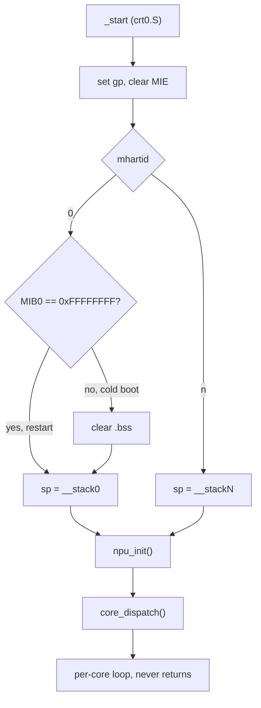
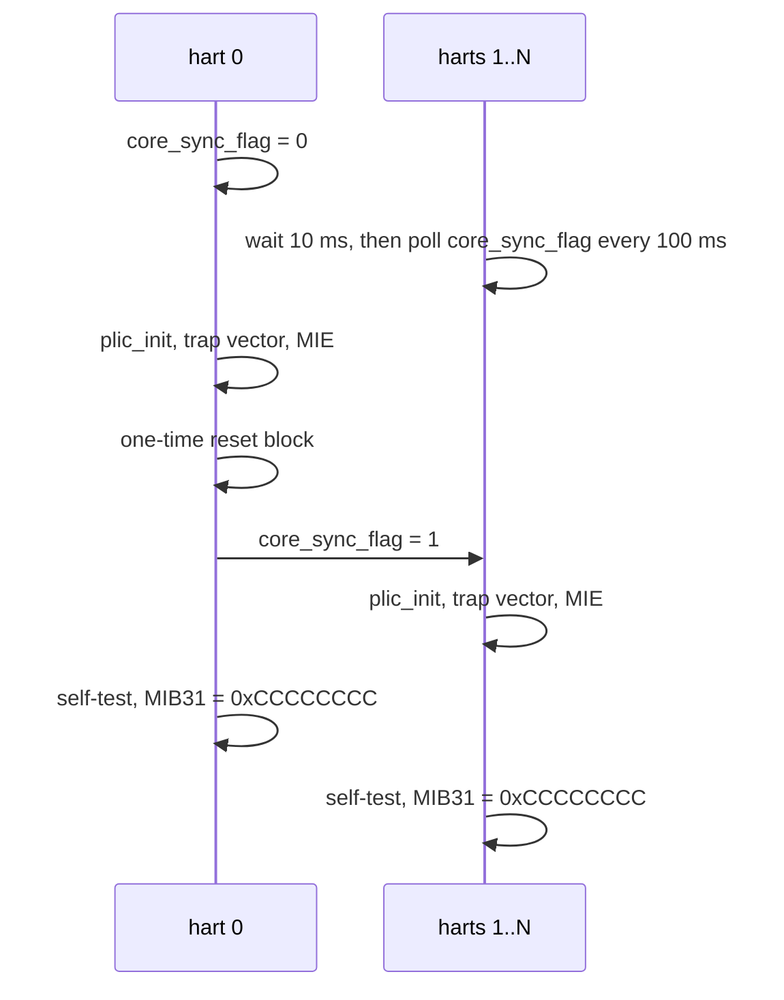

# Boot and Core Dispatch

The host loads `npu_rv32.bin` to DRAM at `0x84000000` and `npu_data.bin`
to SRAM at `0x3E900000`, then releases every hart at `_start`.



## crt0.S

- Eight `nop`s, then `fence.i` and `fence`.
- `gp` is `__global_pointer$`, which is `.data` start + `0x800`.
- Machine interrupts stay off until `npu_init` enables them.
- Each hart gets a 16 KB stack in DRAM after the image.
- Hart 0 clears `.bss` unless `MIB0` reads `0xFFFFFFFF`, which marks a
  restart of a running image.

## npu_init



Every hart runs `plic_init`, points `mtvec` at `trap_vector` and sets
`mie` to `0x800` (machine external interrupt only).

The reset block runs once, gated by `npu_reset_pending` (1 in `.data`):

```
MIB21 (0x1EC0C194) saved              printf gate, lost across the reset
sim_mode_flag = MIB12 (0x1EC0C170)
RSTCTRL1 (0x1EC11834) = 0x10001788    assert reset on the NPU internal bus
delay 1 ms
RSTCTRL1 = 0                          release
delay 1 ms
THREAD_ENABLE (0x1EC00F00) = 4, then 1
delay 1 ms
MIB0 (0x1EC0C140) = 0xFFFFFFFF        marks the image as running
boot UART init (0x1EC10000)
debug block cleared and filled (docs/debug.md)
MIB21 restored
print the Bender banner, "core freq at %d MHz",
then "NPU Version: <release>.<wifi chip>.<git hash>"
print the cluster version, enable mask and running cores
check .data + .bss fits 0x7800 bytes
PLIC 22 = boot UART rx console
timer 0 on, period 10
mailbox_init
```

The reset control is `RSTCTRL1` at SCU + `0x834`. Writing SCU + `0x000`
instead leaves the hart stuck on its next MMIO access.

Before `MIB31`, every hart prints its ISA and id registers and the result
of a fixed multiply, divide and memory pass
([debug.md](debug.md#faq) reads the lines).

`MIB31 = 0xCCCCCCCC` tells the host the hart finished init.

## Core dispatch

`core_dispatch()` in `npu_main.c` sends each hart to its `coreN_main`.
The full map per SoC and WiFi family is in the [README](../README.md#core-map).

Core 0 always runs `tdma_init` first. It wipes SRAM and restarts the SRAM
allocator, so no other block may be claimed before it (see
[memory.md](memory.md#sram-allocator)).

Core 3 identifies the package from the chip capability table
(`chip_cap_query`) and powers down ports the package does not have:

| capability bit | missing port | action |
|---:|---|---|
| 1 | USB 1 | USB PHY power down, `0x1FB00830 \|= 0x8000` |
| 2 | USB 2 | USB PHY power down |
| 3 | PCIe 0 | `0x1FA5B460 = 0` |
| 4 | PCIe 1 | `0x1FA5C460 = 0` |

An unknown chip id prints `unknown chipid, module load fail!` and reboots
the SoC through `0x1FB00040`.

## Trap handling

`trap_vector` saves the registers and calls `trap_dispatch`. With
`HAS_LEAN_TRAP` (AN7583 eagle, one PPE return interrupt per burst of
frames) it saves only the 16 a C call may clobber; `trap_dispatch` and
every ISR are C and keep `s0`-`s11` themselves. The entry then sits in
`.text.hot`.

- `mcause` = machine external interrupt: claim from the PLIC and call the
  registered ISR.
- anything else: record `mcause`, `mepc`, `mtval`, `ra` and `sp` in the
  hart's [debug block](debug.md) record, print them, then resume after
  the faulting instruction (2 or 4 bytes).

Around an ISR call the hart's record is marked as in an interrupt, so
debug events raised there are traced but not printed.

Exceptions never go through the ISR table. The default ISR prints, and a
fault inside `npu_printf` would re-acquire the printf mutex it already
holds (see [platform.md](platform.md#hardware-mutex)).

## CPU clock

`cpu_clock_get()` reads the PLL register `0x1FA201FC`. `bits[2:0] + 1` is
the divider and a 2-bit selector picks the base frequency:

| SoC | selector | base (MHz) |
|---|---|---|
| AN7552, AN7581 | `bits[9:8]` | 800, 750, 720, 600 |
| AN7583 | `bits[10:9]` | 666, 800, 720, 600 |

With `MIB12` nonzero at boot (simulation), the clock reads 100 MHz.
