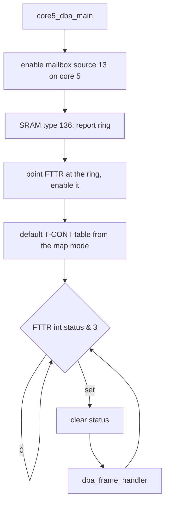
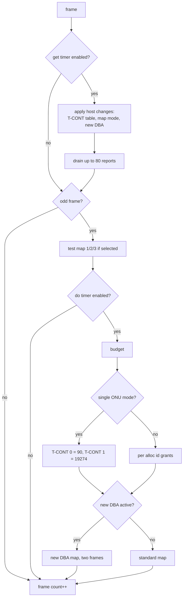

# GPON Dynamic Bandwidth Allocation

AN7583 with a WiFi chip only (`HAS_DBA`). Core 5 runs the upstream
scheduler of the FTTR block: every upstream frame it reads the ONU
reports and writes the next bandwidth map. The code is in `npu_dba.c`.

## FTTR block

Base `0x1FBE4000`. Every FTTR read or write is followed by a dummy read
of `0x1FB00020`.

| offset | register |
|---|---|
| `0x008`, `0x00C` | bandwidth map entry, word 0 then word 1 |
| `0x010` | map control: bit 0 bank in use, bit 1 bank requested, bit 2 empty map |
| `0x408` | frame interrupt status, bits 1:0 |
| `0x418` | T-CONT map mode |
| `0x498`..`0x4AC` | report ring: write index, base, read index, count, config, size |

A map entry is two words:

```
word 0   start << 16 | stop           in bwmap units, a frame is 0x4BC2
word 1   bit  1       DBRu requested
         bit  3       FEC
         bit  4       PLOAMu
         bits 17:6    alloc id
         bit  25      OLT
         bits 28:27   01 map continues in the next frame, 11 last entry
```

## Core 5



`dba_frame_handler` per frame:



## T-CONT table

128 alloc id slots. The map mode decides how a slot index splits into
ONU and T-CONT:

| mode | ONUs | T-CONTs per ONU |
|---:|---:|---:|
| 0 | 32 | 4 |
| 1 | 16 | 8 |
| 2 | 8 | 16 |
| 3 | 64 | 2 |

The default table gives T-CONT 0 of every ONU a fixed grant of 90 and
every other T-CONT best effort with a maximum of 19340.

| DBA type | grant |
|---:|---|
| 1 | fixed bandwidth |
| 2 | assured bandwidth, adapted |
| 3, 5 | assured plus a share of what is left |
| 4 | best effort, a share of what is left |

## Reports

The FTTR block writes 16-byte reports into the ring, two entries each:
non-idle bytes, bytes granted, and a word with DBRu (bits 14:0) and the
alloc id (bits 26:15). Each alloc id keeps its last two reports.

## Grants

1. **Budget.** Sum the fixed and assured grants of every valid alloc id
   and subtract them, with per-burst overhead, from the frame
   (`0x4B8C`, or `0x97E0` over two frames in new DBA mode). The rest is
   split evenly over the type 3, 4 and 5 alloc ids.
2. **Adapt.** For each non-fixed alloc id, compare the requested queue
   (DBRu x 48 bytes) with the unused part of its last grants and step the
   grant up or down through a small state machine.
3. **Fit.** Sort the grants, smallest first. If the demand exceeds the
   budget, cap the largest grants to an even share of what is left.

## Bandwidth map

`dba_bwmap_switch` writes the entries ONU by ONU, T-CONT by T-CONT,
then requests the other map bank. If the previous request has not taken
effect yet (bank in use differs from bank requested), it prints
`switch bwmap failed last time` and skips the flip. When the map turns
empty or non-empty, it sets the empty bit to match.

New DBA mode needs exactly four active ONUs, no FEC and a non-OLT
setup. It orders the ONUs by total grant and spreads one map over two
frames.

## Host commands

Mailbox slot 3 on core 5. Function type 1 (SET_WAIT) or 3 (GET_WAIT).

| id | command |
|---:|---|
| 0 | dump the reports once, 8000 frames later |
| 1 | print the non-idle counts once, 8000 frames later |
| 2 | clear non-idle counts |
| 3 | enable the report drain and the grant step |
| 4 | ONU state; 0 invalidates all its T-CONTs |
| 5 | ONU upstream FEC |
| 6 | T-CONT grant: alloc id, type, fixed, assured, max |
| 7 | T-CONT valid |
| 8 | print a T-CONT |
| 10 | test map 1, 2 or 3 |
| 11, 13 | write an FTTR register |
| 12, 14 | read an FTTR register |
| 15 | T-CONT map mode |
| 16 | OLT mode: burst overhead 75, else 46 |
| 17 | all bandwidth to a single ONU |
| 18 | new DBA enable |
| 19 | clear an ONU's burst count |
| 20 | read an ONU's burst count |

Every mail returns 1.
