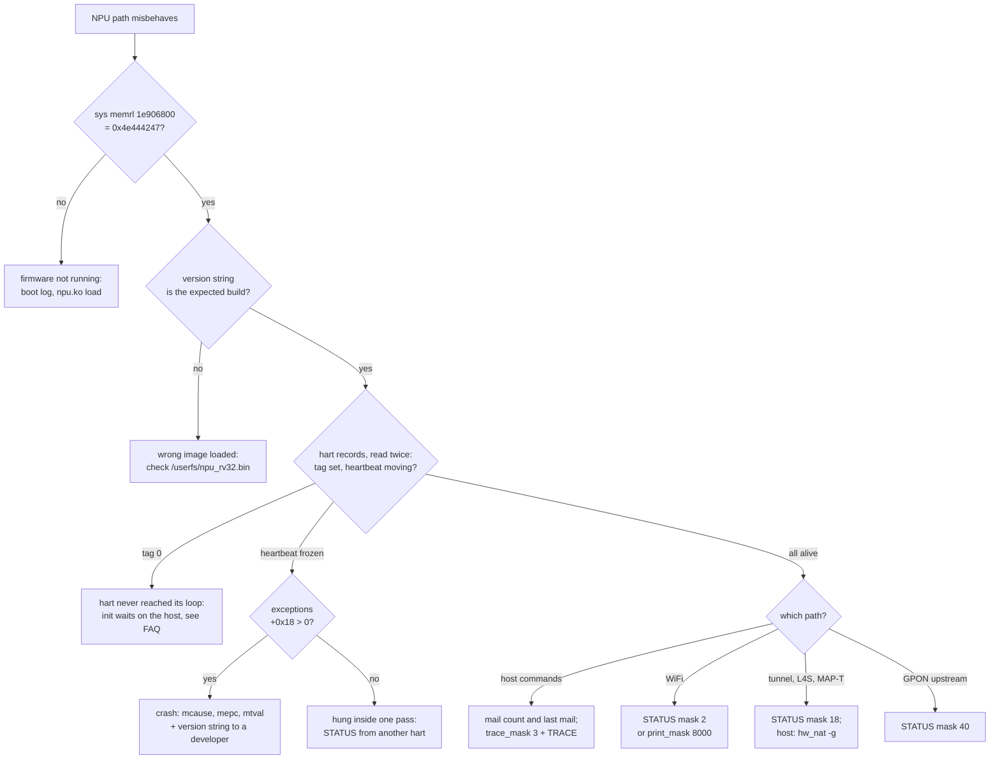

# Field Debugging

Every image carries a 4 KB debug block at a fixed SRAM address. The
host reads and writes it with the stock `sys` shell command, so a
deployed unit needs nothing extra:

| command | effect |
|---|---|
| `sys memrl ADDR` | read one 32-bit word |
| `sys memwl ADDR VALUE` | write one 32-bit word |
| `sys memory ADDR LEN` | hexdump `LEN` bytes, 16 per line |

All arguments are hex, with or without `0x`. The output goes to the
kernel log, so read it with `dmesg` (run `dmesg -n 1` first to keep the
console quiet). `sys` accepts physical addresses from `0x1C000000` to
`0x3FFFFFFF`, which covers the NPU SRAM and every NPU and frame engine
register.

## Addresses

The NPU sees its SRAM at `0x3E8xxxxx`/`0x3E9xxxxx`; the host sees the
same bytes at `0x1E8xxxxx`/`0x1E9xxxxx`. Clear the top three bits of
any address the NPU console prints before handing it to `sys`.

The debug block is at NPU `0x3E906800`, host **`0x1E906800`**, up to
`0x1E9077FF`. AN7552's cluster local SRAM is only 16 KB, so there it is
at NPU `0x3E903000`, host **`0x1E903000`**, the last 4 KB. It sits above
the firmware globals, which the linker keeps below it. Examples below
use the AN758x address.

`sys memory` prints every word most significant byte first. Tags and
text in the block are stored so that they read in order in that dump:

```
# sys memory 1e906800 40
1e906800  4e 44 42 47.00 00 00 01.00 00 10 00.00 00 00 06  |NDBG............|
1e906810  54 4c 42 37.2e 38 2e 30.2e 30 5f 76.30 30 33 2e  |TLB7.8.0.0_v003.|
1e906820  4d 54 37 39.39 33 2e 32.34 31 36 35.32 38 00 00  |MT7993.2416528..|
```

`NDBG` (`0x4E444247`) at offset 0 means the firmware is running and
the block is valid. The version string is the one the boot log prints
as `NPU Version:`.

## Layout

| offset | size | field |
|---:|---:|---|
| `0x000` | 4 | magic `0x4E444247` (`NDBG`) |
| `0x004` | 4 | layout version, 1 |
| `0x008` | 4 | block size, `0x1000` |
| `0x00C` | 4 | number of harts |
| `0x010` | 48 | version string |
| `0x040` | 4 | `trace_mask` |
| `0x044` | 4 | `print_mask` |
| `0x048` | 4 | `cmd_hart`: hart that runs the next command |
| `0x04C` | 4 | `cmd`: command number, 0 when idle |
| `0x050` | 12 | `arg0`, `arg1`, `arg2` |
| `0x05C` | 8 | `ret0`, `ret1` |
| `0x064` | 4 | `done`: count of completed commands |
| `0x068` | 4 | `status` of the last command |
| `0x080` | 8 x 48 | hart records |
| `0x200` | 16 x 8 | symbol table |
| `0x280` | 96 x 4 | counters |
| `0x400` | 8 x 16 x 16 | trace rings, one per hart |
| `0xC00` | 1024 | copy buffer |

### Hart records

Hart `n` starts at `0x1E906880 + n * 0x30`:

| offset | field |
|---:|---|
| `+0x00` | loop tag: which loop the hart runs |
| `+0x04` | heartbeat: bumped on every pass of that loop |
| `+0x08` | 1 while the hart is inside an interrupt handler |
| `+0x0C` | trace write index |
| `+0x10` | mailbox commands this hart handled |
| `+0x14` | last mailbox command: `slot << 24 \| buffer bits 15:0 << 8 \| return` |
| `+0x18` | exceptions taken |
| `+0x1C` | `mcause` of the last exception |
| `+0x20` | `mepc` of the last exception |
| `+0x24` | `mtval` of the last exception |
| `+0x28` | `ra` of the last exception |
| `+0x2C` | `sp` of the last exception |

| tag | loop |
|---|---|
| `TUNL` | tunnel offload and L4S |
| `ERXD` | eagle rxdmad ring |
| `ETXF` | eagle WiFi tx fast path |
| `EC3L` | eagle host adaptor, tx done, package check |
| `EC0L` | eagle AN7552 core 0: queue drain and refill |
| `ERFL` | eagle rx refill |
| `KRX1`, `KRX2`, `KPIP` | kite rx, 2.4 GHz rx, classifier |
| `DBA5` | GPON DBA |
| `IDLE` | nothing to run; serves debug commands |

A hart whose tag is 0 never reached its main loop. A hart whose
heartbeat does not change between two reads is stuck: the loop is
blocked inside one pass. A tag with a moving heartbeat is alive.

### Symbol table

Sixteen `{tag, NPU address}` pairs locate internal state without a map
file. Convert the address to host view before reading it.

| tag | what |
|---|---|
| `GLOB` | start of the globals (`.data`) |
| `BSSE` | end of the globals |
| `MBOX` | mailbox handler table, 80 bytes per hart |
| `SRAM` | SRAM allocation table: `{u16 type, u16 pad, u32 addr}` per entry |
| `TICK` | timer tick counter |
| `BRDG` | variable holding the NPU bridge buffer address |
| `TUNF` | tunnel mail handler table |
| `L4SE` | L4S enable flag |
| `EDBG` | eagle datapath counters, `struct eagle_dbg` in `npu_wifi.h` |
| `KFLG` | kite debug flags: bit 2 turns the kite counter blocks on |
| `KC2G`, `KC5G` | variables holding the kite 2.4 GHz and 5 GHz counter block addresses |

### Counters

Word `i` is at `0x1E906A80 + i * 4`. They count from boot or from the
last `CLEAR` command.

| word | counter |
|---:|---|
| 0 | tunnel packets taken off the bridge |
| 1, 2 | VXLAN encapsulated, decapsulated |
| 3, 4 | SRv6 encapsulated, endpoint |
| 5 | address mapping (MAP-T, UDF 65..68) |
| 6, 7 | IP fragmentation, reassembly |
| 8 | tunnel packets dropped by the handler |
| 9 | packets with an unknown UDF |
| 10 | bridge egress refused for lack of credit |
| 12, 13 | L4S packets forwarded, packets marked CE |
| 14 | last sampled L4S queue length |
| 16, 17 | HWNAT mails, last `funcId << 8 \| result` |
| 20, 21 | DBA mails, DBA frame interrupts |
| 24 | TDMA tx submits that gave up on a full ring |
| 32, 33 | SRAM allocations, bytes allocated |

## Commands

A command runs on the hart named in `cmd_hart`, from that hart's main
loop. Pick a hart whose heartbeat moves; an `IDLE` hart, or core 3 on
the eagle parts, answers at once. The tunnel hart only answers between
packets.

1. write `arg0` and `arg1` (`0x1E906850`, `0x1E906854`),
2. write the hart number to `0x1E906848`,
3. write the command number to `0x1E90684C` (last),
4. read `0x1E90684C` until it is 0, then read `status` (`0x1E906868`)
   and `ret0`/`ret1` (`0x1E90685C`, `0x1E906860`).

| cmd | name | args | result |
|---:|---|---|---|
| 1 | `PING` | | `ret0` hart, `ret1` cycle counter |
| 2 | `READ` | `arg0` NPU address | `ret0` word |
| 3 | `WRITE` | `arg0` NPU address, `arg1` value | `ret0` value read back |
| 4 | `COPY` | `arg0` NPU address, `arg1` bytes (max `0x400`) | words at `0x1E907400`, `ret0` bytes copied |
| 5 | `HEXDUMP` | `arg0` NPU address, `arg1` bytes (0: 64) | console |
| 6 | `STATUS` | `arg0` subsystem mask (0: all) | console |
| 7 | `CLEAR` | | counters and trace rings zeroed |
| 8 | `TRACE` | | trace rings to the console, oldest first |
| 9 | `BRIDGE` | `arg0` 0 dump, 1 reset, 2 flush reassembly | console (tunnel parts) |
| 10 (`0xA`) | `SRAM` | | SRAM allocation table to the console |
| 11 (`0xB`) | `CSR` | `arg0` 0 `mstatus`, 1 `mie`, 2 `mip`, 3 `mtvec`, 4 `mcycle`, 5 `minstret`, 6 `mhartid` | `ret0` |

`status`: 0 done, 1 unknown command, 2 bad argument, 3 not built for
this part. `READ`, `WRITE` and `COPY` take the NPU's own view, so they
also reach what the host cannot map, such as the firmware image at
`0x84000000`.

Console output is the NPU's lines on the shared serial console, each
prefixed `[Cn]` with the hart that printed it.

```
# sys memwl 1e906848 3; sys memwl 1e90684c 6
[C3][DBG] TLB7.8.0.0_v003.MT7993.2416528 harts 6 tick 10144
[C3][DBG] C0 loop 54554e4c beat 588883457 mails 46 last 1400001 traps 0 cause 0 epc 0
[C3][DBG] C1 loop 45525844 beat 8724252 mails 0 last 0 traps 0 cause 0 epc 0
...
[C3][DBG] tunnel pkts 1699652 vxlan 0/0 srv6 629769/600607 map 469276 frag 0 reasm 0 drop 0 invalid 0 egress_fail 0
[C3][DBG] bridge ch0 waiting 0 credits 8
[C3][DBG] l4s on qid 7 thresh 100 pkts 869291 marks 490 qlen 0
[C3][DBG] ppe mails 1 last 101
[C3][DBG] sram allocs 23 used 6ff60
```

## Trace and print masks

Bit `n` of `trace_mask` (`0x1E906840`) records events of subsystem `n`
in the trace ring of the hart that saw them. The same bit in
`print_mask` (`0x1E906844`) also prints each event to the console, except
events raised inside an interrupt handler: those stay in the ring, since
the handler may have interrupted a print.

| bit | subsystem | events (`ev`, `a`, `b`) |
|---:|---|---|
| 0 | `mbox` | `mailbox << 8 \| slot`, buffer address, return value |
| 1 | `wifi` | `funcType << 8 \| funcId`, words 2 and 3 of the WiFi mail |
| 2 | `tdma` | band, software index, hardware index of a full tx ring |
| 3 | `tunnel` | 1 drop (descriptor, length), 2 unknown UDF (UDF, descriptor word 1) |
| 5 | `ppe` | HWNAT `funcId`, result, first argument |
| 6 | `dba` | DBA `funcType`, buffer address |
| 7 | `sram` | address type, address, size |
| 8 | `trap` | `mcause`, `mepc`, `mtval` |
| 15 | `stats` | print only: eagle datapath counters every two seconds from core 3 |

Print bit 1 (`wifi`) also prints the first host tx frame and the first
WiFi tx descriptors per band, and the first four large rx descriptors.

A ring entry is `{tick, hart << 28 | subsystem << 20 | ev, a, b}`; the
ring of hart `n` starts at `0x1E906C00 + n * 0x100` and holds the last
16 events. The hart's write index (hart record `+0x0C`) modulo 16 is the
next slot. `TRACE` prints every ring in order.

The `NPUDBG=1` build starts with print bits 1 and 15 set.

## Troubleshooting

Load this helper into the DUT shell first. It runs one command and
prints the command words; the result is in the dump.

```sh
ndbg() {	# ndbg HART CMD [ARG0] [ARG1], all hex
	sys memwl 1e906850 ${3:-0}; sys memwl 1e906854 ${4:-0}
	sys memwl 1e906848 $1; sys memwl 1e90684c $2
	sleep 1; dmesg -c >/dev/null
	sys memory 1e906840 30; dmesg -c | grep 1e9068
}
```

```
# ndbg 3 2 84000000
1e906840  00 00 00 00.00 00 00 00.00 00 00 03.00 00 00 00   masks, cmd_hart, cmd (0: done)
1e906850  84 00 00 00.00 00 00 00.00 00 00 00.00 01 00 01   arg0, arg1, arg2, ret0
1e906860  95 08 00 b4.00 00 00 02.00 00 00 00.00 00 00 00   ret1, done, status
```

A `cmd` that stays non-zero means the hart named in `cmd_hart` is not
running its loop.

### Where to start



### FAQ

**The magic word is not `4e444247`.**
The NPU never ran `npu_init`, or it ran another image. Look in the boot
log for `copy NPU binary:/userfs/npu_rv32.bin(<size>)` and, right after
the Bender banner, `NPU Version:`. No `copy` line: the NPU module did not
load. A `copy` line without `NPU Version`: the image did not start.

**The version string is not matched with the build.**
The unit booted another image. The string ends in the git hash of the
build; `-dirty` means it was built from uncommitted sources.

**A core is missing, or its self-test says `FAIL`.**
The boot log checks the cores on every start:

```text
[C0]NPU cluster 20220707: cores enabled 3f, running 3f
[C3]core 3: RV32ACIMX vendor 0 arch 1 impl 20210428, self-test ok (1b972363, 114998 cycles)
```

`enabled` is the host's boot mask, `running` the cores whose PC ever
left 0; one bit per core. `Error: 6 cores expected` follows when they
differ from the part's count (AN7552 2, AN7583 6, AN7581 8). Each core
then runs a fixed multiply, divide and memory pass; any sum other than
`1b972363` is a faulty core. A core enabled but not running never
fetched, the same as an absent one. Check it live without a console:

| `sys memrl` | holds |
|---|---|
| `1ec06004` | enable mask |
| `1ec05N00`, `1ec05N04` | core N PC and SP; a PC that changes between reads is executing |

**A hart's loop tag is 0.**
That hart is still in its init. On AN7583 hart 0 takes `TUNL` only once
the WiFi init is done, and that init waits for the host's WiFi setup
commands; a tag of 0 there with no WiFi traffic means the host WiFi
driver never finished its NPU setup. Its mail count (hart record
`+0x10`) shows how far the host got.

**A heartbeat does not move.**
The hart is stuck inside one pass of its loop.

| also seen | meaning | next |
|---|---|---|
| exceptions (`+0x18`) above 0 | the hart crashed | read `mcause`, `mepc`, `mtval` (table below) |
| `STATUS` `tdma tx_full` rising | the wired-side ring stays full | the frame engine is not taking frames |
| `STATUS` bridge `credits 0` | the tunnel hart waits for bridge credit | the frame engine is not taking tunnel packets back |
| nothing else | the hart waits on hardware or on another hart | run `STATUS` on a live hart, compare with a good unit |

| `mcause` | exception |
|---:|---|
| 0, 1 | instruction address misaligned, access fault |
| 2 | illegal instruction |
| 4, 5 | load address misaligned, access fault |
| 6, 7 | store address misaligned, access fault |

`mepc` is the faulting instruction, `mtval` the faulting address. The
hart stepped over the instruction and carried on, so a crash does not
always stop it; a rising exception count is still a fault. Send the
version string with the values: they locate the instruction in that
build.

**A command never completes (`cmd` stays non-zero).**
`cmd_hart` names a hart that is not in its loop, or one that does not
exist on this part (`0x1E90680C` holds the hart count). Write 0 to
`cmd` and send it to a hart with a moving heartbeat.

**A printing command shows nothing.**
The NPU prints on the serial console, not in `dmesg`. Without a serial
console, use the words the block holds: counters, hart records, `READ`
and `COPY`.

**The host says it configured something; did the NPU get it?**
Read the mail count and last mail of the hart the host talks to (hart
0 for WiFi, tunnel and HWNAT commands; hart 5 for DBA). A count that
does not move: the command never arrived. `last mail` ends in the
handler's return value; 0 means the handler refused it, and the
console shows `... operation fail !`. For the full sequence set
`trace_mask` to 3, repeat the host action and run `TRACE`: each WiFi
mail shows `funcType << 8 | funcId`.

**WiFi traffic stops or is slow (eagle).**
Run `STATUS` with mask 2, or set `print_mask` to `8000` for a report
every two seconds. Read the lines in order:

| line, field | stuck at | meaning |
|---|---|---|
| `rxo ... state=a/b/c` | `a` or `b` is 0 | the host has not started rx or tx on the NPU |
| same | `c` is not 3 | the WiFi tx queue is not running |
| `tx in` | not moving while WiFi clients receive nothing | the host sends nothing to the NPU |
| `tx full` | rising | WiFi tx ring full or no free token: the WiFi chip is not sending |
| `rx rxd` | not moving while clients send | the WiFi chip writes nothing to the NPU rx ring |
| `rx fast` | not moving, `q` moving | frames go to the host, not to the wire: the flows are not offloaded |
| `rx drop` | rising | the host queue is full |
| `rxo full` | rising | the host does not drain the host adaptor ring |
| `lan push` | not moving with wired-to-WiFi traffic | offloaded wired-to-WiFi frames do not reach the NPU |
| `lan fail` | rising | no free token or WiFi tx ring stuck |

**WiFi traffic stops (kite).**
The kite counter blocks run only while bit 2 of the byte at `KFLG` is
set: read the word holding it, set the bit, write it back. Their
addresses are in the variables at `KC2G` and `KC5G`.

**Tunnel, L4S or MAP-T traffic misbehaves.**
Run `STATUS` with mask `18`.

| seen | meaning |
|---|---|
| `tunnel pkts` 0 | no flow is steered to the NPU: check the host (`hw_nat -g`, the feature's enable, a flow table flush after enabling) |
| the class counter for the feature stays 0 | the host binds the flows another way (VXLAN always runs in the frame engine) |
| `drop` rising | the handler refused packets and returned them as drops |
| `invalid` rising | the host bound flows with a tunnel type this firmware has no handler for; the trace (bit 3) shows the type |
| `egress_fail` rising | the bridge has no credit: the frame engine does not take packets back |
| a bridge channel with `waiting` above 0 that does not drain | nothing polls that channel; channel 0 (1, 2 for L4S) needs the `TUNL` hart alive |
| `l4s pkts` 0 with L4S on | no flow carries ECN bits, or flows were bound before L4S was enabled |
| `l4s marks` 0, `pkts` rising | queue `qid` never exceeded `thresh`: no congestion, nothing to mark |
| MAP-T TCP at a few hundred kbit/s, UDP fine | host translator issue, see [errata](errata.md) H1 |

`BRIDGE` with `arg0` 0 prints the bridge hardware's own per-channel
counters. On the host, `echo dump > /proc/tc3162/hwnat_npu_debug` prints
the frame engine's counters towards the NPU followed by the same
bridge counters.

**GPON upstream grants look wrong.**
`STATUS` with mask `40`: `dba mails` counts host DBA commands, `frames`
counts bandwidth map interrupts. Frames that do not move mean the PON
MAC raises no interrupt; mails that do not move mean the host never
configured the DBA.

**Where is a ring or table in memory?**
`SRAM` prints every allocation with its type and NPU address. Clear
the top three bits for `sys memory`.

**How do I read memory the host cannot map?**
`COPY` with the NPU address and a length, then
`sys memory 1e907400 <length>`. For one word, `READ`.
