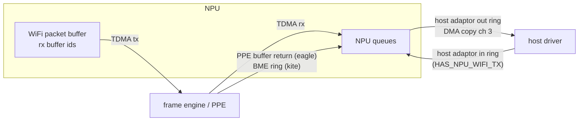

# DMA Paths

The rings and engines that move frames between the NPU, the host and the
wired side. Ring layouts of the WiFi chip itself are in
[wifi-eagle.md](wifi-eagle.md) and [wifi-kite.md](wifi-kite.md).



## Host adaptor

`hostadpt_init` (core 0) waits until the host has written the ring
bases, then marks `hostadpt_tx_ring_ready`.

### Out rings, NPU to host

Two rings, one per band, 512 entries of 24 bytes. Ring 0 base at
`0x1EC0D180`, ring 1 at `0x1EC0D190`; the write index is at `+0x08` of
each.

```
word 0   bit 0 valid, bits 14:1 length of this segment, bits 28:15
         length of the whole frame, bit 29 last segment
word 1   bits 15:0 wcid, bits 20:16 A-MSDU, bits 31:26 forward type
word 2   rx info
word 3   host buffer address, filled by the host
```

`host_ring_submit` copies the frame into the host buffer with the DMA
copy engine (channel 3), then writes words 2, 1 and 0, in that order,
so the valid bit lands last. The copy is capped at
1792 bytes on eagle and on parts with `HAS_NPU_WIFI_TX`, 3500 bytes
otherwise. If the entry two slots ahead is still valid, the ring counts
as full and the call fails.

With `HAS_ASYNC_COPY` (AN7583 eagle) the eagle drain splits this in two:
`host_out_start` claims the slot, reads its buffer address, then
finishes the previous frame and starts this frame's copy;
`host_out_finish` waits, writes the words and publishes the index. The
next frame is read and claimed while a copy runs. Only one copy is in
flight at a time. A frame chained over several slots goes through
`host_out_chain`: every segment is copied first, then the valid bits
are written from the last segment to the first, because the host busy
waits a millisecond, up to three times, on a head whose tail is not
valid yet. With two in flight (channels 3 and 2) the host got
damaged TCP streams, though every copy checked correct in isolation.

### In rings, host to NPU

`HAS_NPU_WIFI_TX` only (AN7581 except MT7916, AN7583 eagle). Two rings
with bases at `0x1EC0D0A0` and `0x1EC0D0B0`, entries of 208 bytes, bit 0
of word 0 set by the host when the entry is ready. Eagle core 3 drains
them into the tx staging ring.

## DMA copy engine

`bridge_dma_copy(ch, src, dst, len)` writes source, destination and
`len << 16 | 0x23`, then spins on the channel's status bit and clears it.
All addresses are physical.

The engine is the SoC GDMA (`0x1FB30000`, 16 bytes per channel). Control
word: bit 0 software mode, bit 1 enable, bits 5:3 burst size, bits
31:16 length. `0x23` is the largest burst, 64 bytes; values 5 to 7 copy
nothing and never set the done bit. Channels in use: 0 host tx frame
and TXD (core 3), 1 TXD into the WiFi tx ring (core 2), 3 host adaptor
out ring (core 3). Measured on AN7583:

| copy | cycles |
|---|---:|
| 64 bytes | 280 |
| 256 bytes | 906 |
| 1500 bytes | 4760 (about 3.2 per byte, 250 MB/s) |
| 1500 bytes, destination 2 bytes off | about 5200 |
| two 1500-byte copies on two channels at once | 9500 |

All channels share one engine: parallel copies take as long as the
same copies in a row, and splitting one copy over two channels is
slower.

## TDMA

AN7552 and AN7583 with a WiFi chip (`HAS_BME`). AN7581 has no TDMA WiFi
path.

### TDMA tx, WiFi to wired

Two rings (one per band) of 1024 descriptors of 8 bytes, SRAM type 132,
ring 1 at `+0x2000`. Registers at `0x1FB50800`, stride `0x10`.

```
word 0   bits 12:0 length, bits 28:14 buffer id, bit 30 set by the NPU
word 1   buffer address | 0x80000000
```

Descriptors start as `(d & 0x3FFFC000) | 0xC0000800`. `tdma_tx_submit`
pads frames to 60 bytes and gives up after five tries when fewer than
five slots are free.

With `HAS_HOT_TEXT` (AN7552 kite, AN7583 eagle) the free-slot count of
each ring is kept from the last DMA index read and lowered per submit,
so the index is read only when the count drops to four. The fast
submit makes no calls: counters on or a near-full ring go to
`tdma_tx_submit_slow`. It writes word 0 whole as
`0x40000000 | token << 14 | length`. Kite holds mutex 0, taken inline;
eagle takes none, since only the rxdmad hart submits.

`tdma_set_tx_ring_to_int` writes `0x01010101`/`1` for ring 0 and
`0x02020202`/`0x11` for ring 1 to `0x1FB50A2C`/`0x1FB50A28`. Bit 0 of
`0x1FB50A28` does not read back, so the log shows `=0` and `=10`.

`TDMA_GLB_CFG` (`0x1FB50A04`): AN7552 only ORs in `0x1`, `0x40` and
`0x30`. AN758x also sets bits 22 and 23, sets `0x3000` in bits 13:11 and
ORs `0x40004000` into `TDMA_FC_CFG0` and `TDMA_FC_CFG1`.

Flow control: on chip family 15 (AN7552) `TDMA_FC_CFG0 = 0x80048004`
and `0x1FB501BC = 0x00EB00EA`; elsewhere `TDMA_FC_CFG2 = 3`.

`TDMA_WIFI_BUF_CFG` (`0x1FB50FE8`) depends on the WiFi family:

| WiFi | write |
|---|---|
| eagle | `(x & 0xFFB300FF) \| 0x190100` |
| kite | `(x & 0xFFF300FF) \| 0x590100` |

### TDMA rx, wired to WiFi

AN7583 eagle only. Two rings of 1024 descriptors of 32 bytes,
SRAM type 133, registers at `0x1FB50900`. `tdma_rx_init` waits for the
host's tx packet buffer address (SET_WAIT 23), then points every
descriptor at a 2 KB slot of that buffer through a tx token. Frames the
PPE forwards to WiFi arrive here; eagle core 2 moves them into the WiFi
tx ring.

## Returning unforwarded frames

WiFi frames sent to TDMA tx that the PPE does not forward come back to
the NPU for delivery to the host.

### PPE buffer return FIFO (eagle)

PLIC source 95, `ppe_wifi_bufid_isr` on core 0.

```
0x1FB50FE4   bits 15:0 entries waiting
0x1FB50FE0   bit 31 valid, bit 30 free only, bits 15:0 buffer id
0x1FB50FDC   bits 14:0 wcid, bits 20:16 rx info
```

Each entry is popped by writing `0x80000000` to `0x1FB50FE0`. A "free
only" entry returns the buffer id; any other goes to the host queue.
Without this handler, unbound WiFi to LAN flows (DHCP included) never
reach the host.

### BME ring (kite)

PLIC source 32 (24 on AN7552), `bme_done_isr`. A 512-entry ring of
8-byte descriptors, SRAM type 134: word 0 bit 31 valid, bits 15:0 buffer
id; word 1 bits 15:0 wcid, bits 20:16 rx info. The ISR forwards each
entry to the host node ring and writes the read index back.

## Buffer manager (BMGR)

Kite runs the hardware buffer id allocator. `tdma_bmgr_init` hands it
the rx buffer id ring (SRAM type 138), writes the init trigger at
`BMGR_BASE + 0x20` and waits for the ready bit (bit 3 on AN7552, bit 0
elsewhere). Its status interrupt (source 33, 25 on AN7552) is only
acknowledged.

After a WiFi stop, `tdma_bmgr_reinit` waits until the PPE has returned
every buffer, then rebuilds either the hardware allocator or the
software pool.

AN7581 uses a software pool instead (`buf_mgr_init`, SRAM type 140,
5600 ids).
