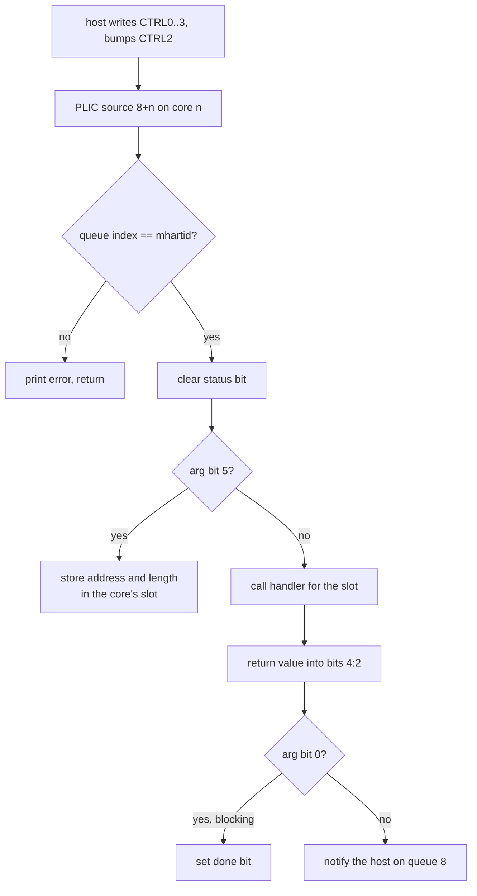

# Mailbox and Host Commands

The host configures the firmware through the mailbox block at
`0x1EC0C000`. Each core has its own queue; queue 8 carries notifications
from the NPU back to the host.

## Registers

```
+0x000             interrupt status, write 1 to clear
+0x004 + n*4       interrupt mask n; mask n+1 = 1<<n routes queue n to core n
+0x030 + q*0x10    CTRL0  buffer address
+0x034 + q*0x10    CTRL1  length (16 bits)
+0x038 + q*0x10    CTRL2  doorbell counter, the sender increments it
+0x03C + q*0x10    CTRL3  arg and status (16 bits)
+0x140 + n*4       MIB n, parameter and handshake words
```

CTRL3 bits:

| bits | meaning |
|---|---|
| 0 | sender waits for completion |
| 1 | done |
| 4:2 | handler return value |
| 5 | store only: keep the buffer, call nothing |
| 14:11 | function slot |

## Mail flow



`mailbox_init` (core 0, at boot) routes queue n to core n, registers
`mbox_isr` on sources 8..8+N-1 and fills the handler slots.

## Function slots

| core | slot | handler | built when |
|---:|---:|---|---|
| 0 | 0 | `wifi_mail_dispatch` | a WiFi chip is selected |
| 0 | 1 | `tunnel_mail_dispatch` | always |
| 0 | 4 | `kite_wifi_config` / `eagle_wifi_config` | AN7581 with WiFi |
| 0 | 5 | `hwnat_mail_dispatch` | AN7581, AN7583 |
| 5 | 3 | `dba_mail_handler` | AN7583 with WiFi |

## Host notify

`mbox_notify_host(core, func, value)` answers a non-blocking mail:

1. take the notify mutex (14, or 30 on AN7581) with priority,
2. write `CTRL0 = core`, `CTRL1 = value`, `CTRL3 = func << 11` on queue 8,
3. increment `CTRL2`,
4. poll `CTRL3` bit 1 for up to 30 ms,
5. release the mutex.

A timeout prints `Error: npuMbox_notify_host timeout ...` and returns 0;
otherwise it returns the host's `CTRL3` bits 4:2.

## WiFi commands (slot 0)

The mail buffer is in host DRAM. Word 0 bits 7:4 are the function type
and bits 3:0 the interface id; word 1 is the function id; the arguments
follow.

| type | name | ids | behavior |
|---:|---|---|---|
| 1 | SET_WAIT | 0..30 | `set_wait_func_table` |
| 2 | SET_NO_WAIT | 0 | no handler, returns 1 |
| 3 | GET_WAIT | 0..9 | `get_wait_func_table` |
| 4 | GET_NO_WAIT | 0 | no handler, returns 1 |

- An id past the table prints `Error: exceed max num!` and returns 0.
- A handler that returns 0 prints `wifi_mail_<type>_operation fail !`.
- An unknown type prints `not support unknow funcType` and returns 1.

The interface id is a band on kite and a ring id on eagle. Both families
share the table shape; each has its own handler set
(`npu_wifi_kite.c`, `npu_wifi_eagle.c`).

| id | SET_WAIT | | id | GET_WAIT |
|---:|---|---|---:|---|
| 0 | PCIe base | | 0 | NPU info |
| 1 | ring descriptors | | 1 | last rate |
| 2 | init done | | 2 | counters |
| 3 | transfer to CPU | | 3 | debug counters |
| 4 | BA window size | | 4 | rx descriptor base |
| 5 | driver model | | 5 | per-station debug counters |
| 6 | delete station | | 6 | DMA address |
| 7 | DRAM BA node | | 7 | ring size |
| 8 | packet buffer | | 8 | MDC lock |
| 9 | no-BA test | | 9 | dump mapping |
| 10 | flush one | | | |
| 11 | flush all | | | |
| 12 | force to CPU | | | |
| 13 | PCIe state | | | |
| 14 | PCIe port type | | | |
| 15 | retry limit | | | |
| 16 | BAR info | | | |
| 17 | fast flag | | | |
| 18 | band 0 on CPU | | | |
| 19 | tx ring PCIe base | | | |
| 20 | tx descriptor | | | |
| 21 | tx buffer space | | | |
| 22 | rx ring for tx done | | | |
| 23 | tx packet buffer | | | |
| 24 | inode tx/rx register | | | |
| 25 | debug flag | | | |
| 26 | inode config | | | |
| 27 | inode stop | | | |
| 28 | PCIe swap | | | |
| 29 | rate limit | | | |
| 30 | chip info | | | |

The eagle bring-up order is in [wifi-eagle.md](wifi-eagle.md#bring-up).

## Tunnel commands (slot 1)

The buffer is in NPU SRAM. Word 0 is the function id.

| id | command |
|---:|---|
| 0 | store a VXLAN header template (index at +8, 50 bytes at +9) |
| 1 | no operation |
| 2 | VXLAN encapsulation MTU |
| 3 | store an SRv6 header template (index 0..7, length, bytes) |
| 4 | local SRv6 IPv6 address |
| 5 | fragmentation MTU per index |
| 6 | bridge debug: 0 dump counters, 1 reset, 2 flush reassembly |
| 7 | address mapping table base, 40 bytes per entry (UDF 65..68) |
| 8 | L4S: 0 off, 1 on, 2 debug, 3 queue id |

Every handler returns 1. The table has 10 entries; id 9 has no handler.
Ids 9 and up return 0 without calling anything.
Details are in [tunnel.md](tunnel.md).

## HWNAT commands (slot 5)

The buffer is in host DRAM: word 0 function type (must be 1, SET_WAIT),
word 1 function id.

| id | command | returns |
|---:|---|---|
| 1 | HWNAT_INIT: store the board config, program the PPE | 1 |
| 2 | HWNAT_DEINIT: undo the PPE setup | 1 |
| 3 | API: PPE table entry write, value write or clear | 1 on success |
| 4 | flow statistics setup | 0 |
| 5 | L4S setup, prints `L4S not support!!!` | 1 |

A result of 0 prints `hwnat_mail_set_wait_operation fail !`. Details are
in [tunnel.md](tunnel.md#ppe-and-hwnat).

## DBA commands (core 5, slot 3)

Function type 1 sets, 3 gets. See [dba.md](dba.md#host-commands).
