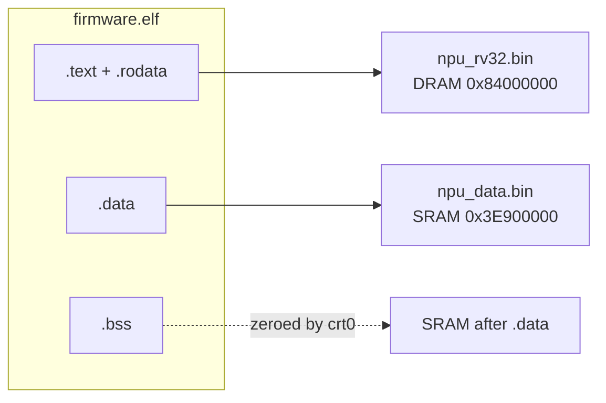

# Memory

## Address map

```
0x0C000000  PLIC
0x1EC00F00  thread enable
0x1EC03000  hardware mutex
0x1EC08800  buffer manager (BMGR)
0x1EC0B800  buffer move engine (BME), 0x1EC08000 on AN7552
0x1EC0C000  mailbox, MIB registers at +0x140
0x1EC0D0A0  host adaptor rings
0x1EC10000  boot UART
0x1EC10100  timer bank 0, bank 1 at 0x1EC10200
0x1EC11000  SCU
0x1EC12000  NPU bridge
0x1FB50000  frame engine: GDM, TDMA, PPE
0x1FBE4000  FTTR (GPON bandwidth map), AN7583
0x1FBF0000  SoC UART
0x3E800000  NPU SRAM: 256 KB AN7552, 480 KB AN7581, 512 KB AN7583
0x3E900000  firmware .data and .bss (inside the SRAM window)
0x3E906800  debug block, 4 KB (docs/debug.md), 0x3E903000 on AN7552;
            globals end below it
0x84000000  firmware code, rodata and stacks in host DRAM
```

## Address translation

The NPU and the host see the same memory at different addresses.

| memory | host physical | NPU address |
|---|---|---|
| NPU SRAM | `0x1E800000` | `0x3E800000` (+ `0x20000000`) |
| host DRAM, uncached | `pa` | `(pa & 0x3FFFFFFF) \| 0x40000000` |

Anything handed to hardware or to the host (ring bases, descriptor
buffer pointers) is a physical address, `addr & 0x1FFFFFFF` for SRAM.
Anything the host passes in (mail buffers, ring bases) goes through the
DRAM rule before the NPU reads it.

## Images



- `npu_rv32.bin`: code and constants, fetched through the instruction
  cache from host DRAM.
- `npu_data.bin`: initialized globals, in single-cycle NPU SRAM. The
  function pointer tables for mail dispatch and the timer tables live here.
- `.bss` follows `.data`. `.data` plus `.bss` must fit `0x7800` bytes;
  `npu_init` prints an error if they do not.
- Stacks are 16 KB per hart, in DRAM after the image.

`npu_globals.c` is the only source of `.data` and the Makefile compiles it
first, so the order of its definitions is the layout of `npu_data.bin`.

## SRAM allocator

`sram_buf_alloc(type)` in `npu_sram.c` hands out SRAM blocks from
`0x3E800000` upward.

- Blocks are keyed by an address type (1..255) and each type has a fixed
  size from a per-variant table. Types 1..128 are WiFi rings and tables,
  129 and above are bridge, DMA and DBA buffers.
- Allocating a type that already exists returns the existing block and
  prints `already exist!!AddrType=...`.
- Each block starts on a 32-byte boundary.
- The allocator holds hardware mutex 18.
- `tdma_init` zeroes the whole SRAM and resets the allocator. Core 0 runs
  it first; any block claimed earlier is lost.

| type | block |
|---:|---|
| 1 | PCIe descriptor block: every WiFi ring the chip reads or writes |
| 2, 3 | eagle packet queue / kite piNode ring, per band |
| 4 | kite BA node pool |
| 6 | kite 2.4 GHz rx buffer id table |
| 7, 8 | kite BA tables |
| 9, 10, 11 | debug counter blocks, 5 GHz / 2.4 GHz / common |
| 12, 13 | kite reorder index pools |
| 14, 15 | eagle multi-segment queue / kite rxNode ring, per band |
| 16, 17 | eagle host tx staging, per band |
| 18 | eagle tx token ring |
| 19, 20 | per-station counter blocks |
| 21 | kite pipeline queue |
| 22 | eagle ICV error table |
| 23 | eagle tx done token ids |
| 25 | eagle indirect command state |
| 26 | eagle MSDU page id pool |
| 28 | eagle tx buffer state |
| 29 | eagle TDMA rx buffer ids |
| 30 | reserved |
| 31 | AN7552 eagle buffer sync bytes |
| 129 | NPU bridge packet buffer |
| 132 | TDMA tx rings |
| 133 | TDMA rx rings |
| 134 | BME descriptor ring |
| 136 | DBA report ring |
| 138 | rx buffer id ring |
| 140 | AN7581 software buffer id pool |

### Core 0 allocation order

| step | types |
|---|---|
| `tdma_init` | wipe SRAM, reset the allocator |
| `bufid_pool_init` (eagle) | 138, 18, 28, 29 |
| `tdma_bmgr_init` (kite) | 138 |
| `core0_wifi_init_wrapper` | 1, then the ring and table types |
| `npu_bridge_buf_init` | 129 |

AN7552 eagle has no tx tokens: it allocates 138, then 129, then 1.

### PCIe descriptor block

Type 1 holds every eagle ring at a fixed offset, so it is a single
reservation that nothing else may overlap. `eagle_ring_desc_base(id)`
returns a ring's base:

| id | ring | AN7581, AN7583 | AN7552 |
|---:|---|---:|---:|
| 1 | rx ring 0 | `0x00000` | `0x00000` |
| 2 | rx ring 1 | `0x140A0` | `0x0C080` |
| 3 | WiFi tx ring 0 | `0x06020` | none |
| 4 | WiFi tx ring 1 | `0x1A0C0` | none |
| 5 | MSDU page ring | `0x0E020` | `0x06000` |
| 6 | indirect command ring | `0x0E0A0` | `0x06080` |

The block is `0x220C0` bytes, `0x12080` on AN7552.
