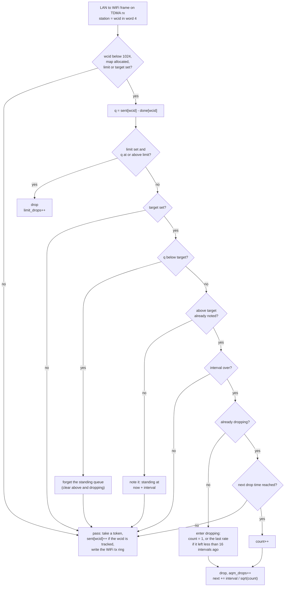
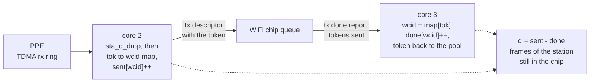
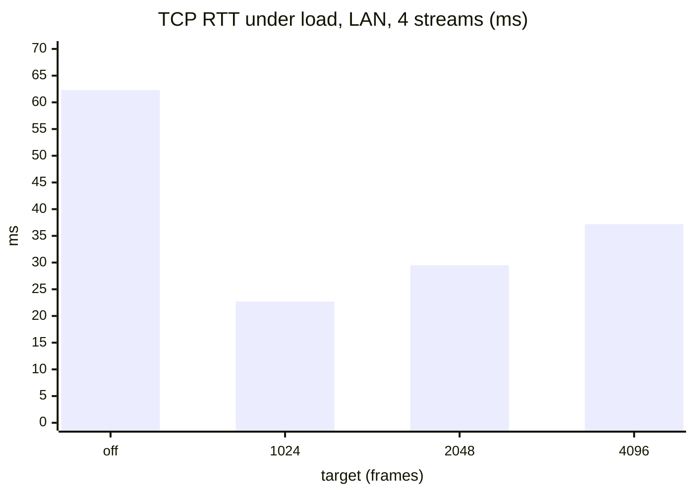
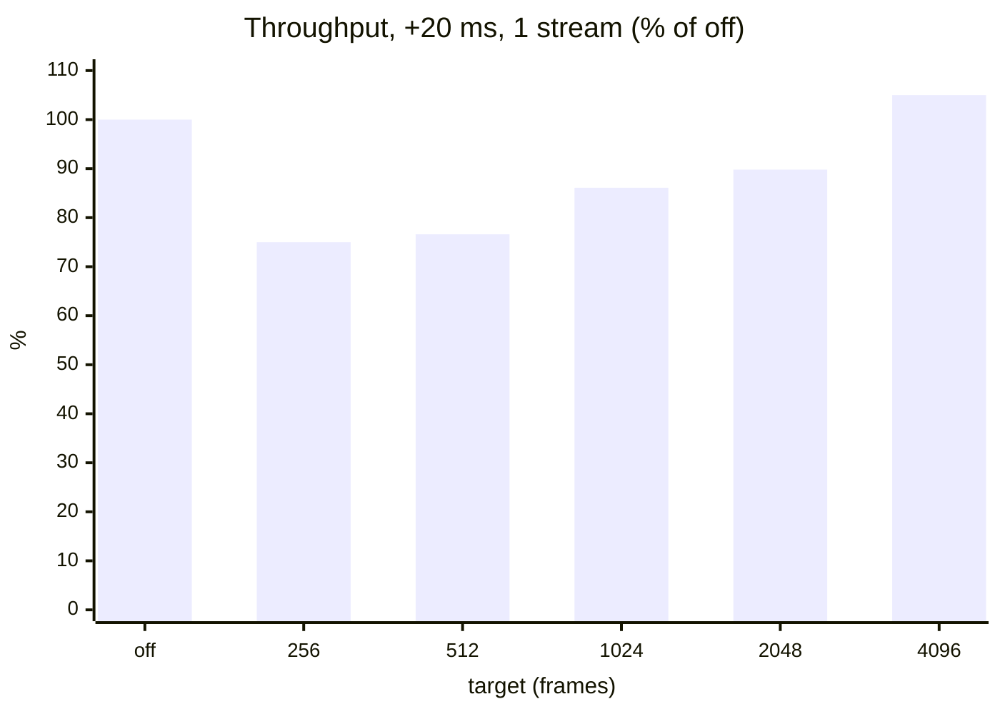
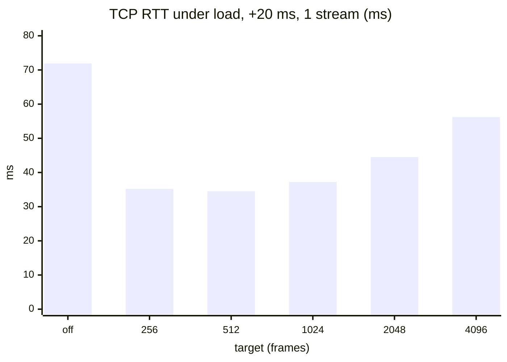

# Per-Station Queue Limit

LAN to WiFi frames the NPU forwards never pass through the host's
queueing (qdisc, fq_codel, AQL). The NPU hands each frame to the WiFi
chip with a tx token, and the chip keeps it until it is sent. The only
limit on that queue is the tx token pool, 13312 tokens of which 11263
are free when the TDMA rx rings are stocked, and every station on both
bands and the host path share it.

One fast download fills that queue:

- **Latency.** The sender's TCP window sits in the chip. A 1.3 Gbit/s
  download to one client keeps 4000 to 10000 frames there, 40 to 70 ms
  of queueing on every packet of that station.
- **Stability.** When the pool runs dry the NPU drops LAN frames at
  random, and host frames to every station (ARP, DHCP, EAPOL, the first
  packets of a flow before HWNAT binds it, CPU traffic) wait for a
  token. Under a 2 Gbit/s flood at one client the NPU refused 33000
  host frames a token, and a ping to that client stalled up to 2.6 s.

`npu_sta_q.c` counts each station's frames in the chip and drops early,
per station, before either happens. Code and hooks are in
[wifi-eagle.md](wifi-eagle.md#per-station-queue-limit).

## How it decides

For each LAN to WiFi frame, before it takes a token, with `q` the
frames of its station in the chip:

1. `q >= limit`: drop. A hard backstop; it keeps `11263 - limit`
   tokens for everyone else whatever one station does.
2. `q < target`: pass, and forget any earlier standing queue.
3. `q >= target` for less than `interval`: pass. Bursts, TCP slow start
   and a client's short power save naps are allowed.
4. `q >= target` for a whole `interval`: a standing queue. Drop one
   frame, then one every `interval / sqrt(n)` while it stands, `n`
   counting the drops, as CoDel does (RFC 8289). The first frame with
   `q < target` ends the drops.



A dropped frame never takes a token: its TDMA slot is re-armed with the
buffer it already holds. TCP answers the loss by halving its window
instead of filling the chip.

The count `q` comes from two counters per station, each written by one
hart only, so no lock is needed:



## Settings

| field | default | unit | effect |
|---|---:|---|---|
| `limit` | 8192 | frames | hard cap per station; 0 turns it off |
| `target` | 4096 | frames | standing queue threshold, about 30 ms at 1.6 Gbit/s; 0 turns the drops off |
| `interval` | 100 ms | cycles | how long a queue must stand; 72000000 at 720 MHz |
| `limit_drops` | | frames | drops by the hard cap, since boot |
| `aqm_drops` | | frames | drops against a standing queue, since boot |

The target is in frames, not time: 4096 frames is about 30 ms at
1.6 Gbit/s and longer for a slower station, whose queue the WiFi chip
already caps on its own.

### Changing them at run time

The five fields are `struct wifi_sta_q`, whose NPU address the
[debug block](debug.md#pcie-descriptor-block) symbol table gives under
tag `SQLM` (`0x53514C4D`). From the host, values in hex:

```sh
sys memory 1e906a00 80           # symbol table: find the word 53514c4d
                                 # the next word is the address, e.g. 3e900208
sys memory 1e900208 14           # limit, target, interval, limit_drops, aqm_drops
sys memwl 1e90020c 800           # target 2048 frames
sys memwl 1e90020c 0             # standing queue drops off
sys memwl 1e900208 0             # hard cap off
```

Clear the top three bits of the address for the host view
(`0x3E900208` reads as `0x1E900208`). The address moves between
builds; read it from the symbol table rather than keeping it. A write
takes effect with the next batch the tx hart drains. The defaults come
back when the host sets up the tx done ring again, at WiFi driver load;
`wifi down` and `wifi up` keep the values and the counts.

## Measurements

AN7583 + MT7993, 5 GHz 160 MHz. A WiFi 6 client (2x2, HE-MCS 11,
2.4 Gbit/s PHY) receives TCP (CUBIC, iperf3, 15 to 20 s) from a host on
a 2.5 Gbit/s LAN port. "+20 ms" adds 20 ms of delay at the sender, like
a server on the internet. TCP RTT is the mean smoothed RTT the sender
measured: the queueing its own packets saw. Runs of each setting were
interleaved with runs with the limit off; throughput is given against
those, as the client's rate drifted 1.2 to 1.35 Gbit/s between batches.
2 to 9 runs per point.

### LAN, 4 streams

| target | throughput | vs off | TCP RTT |
|---|---:|---:|---:|
| off | 1308 Mbit/s | 100 % | 62.3 ms |
| 1024 | 1287 Mbit/s | 98.8 % | 22.7 ms |
| 2048 | 1287 Mbit/s | 98.2 % | 29.5 ms |
| **4096** | 1321 Mbit/s | 101.5 % | **37.2 ms** |



With one stream: off 56.6 ms, 1024 16.5 ms, 2048 17.6 ms, 4096 26.6 ms,
throughput 97.5 to 99.9 % of off.

### +20 ms, 1 stream

| target | throughput | vs off | TCP RTT |
|---|---:|---:|---:|
| off | 1195 Mbit/s | 100 % | 71.9 ms |
| 256 | 927 Mbit/s | 75.0 % | 35.2 ms |
| 512 | 947 Mbit/s | 76.6 % | 34.5 ms |
| 1024 | 1026 Mbit/s | 86.1 % | 37.2 ms |
| 2048 | 1034 Mbit/s | 89.8 % | 44.5 ms |
| **4096** | 1264 Mbit/s | 105.0 % | **56.2 ms** |





With 4 streams: off 83.5 ms; 1024 49.1 ms at 90.4 %; 2048 51.7 ms at
92.3 %; 4096 67.8 ms at 96.5 %. The 20 ms of added delay is part of
every RTT here.

### Why not a fixed cap

A per-station cap alone (`limit` with `target` 0) gives the lowest
latency on the LAN (1024 frames: 6.8 ms, 1205 Mbit/s against 1236 off)
but tail drop cuts every burst, and at internet RTTs TCP never refills
the window:

| `limit`, +20 ms | 1 stream | 4 streams | TCP RTT, 1 stream |
|---|---:|---:|---:|
| off | 1101 Mbit/s | 1001 Mbit/s | 76.6 ms |
| 1024 | 360 Mbit/s | 437 Mbit/s | 26.6 ms |
| 2048 | 556 Mbit/s | 666 Mbit/s | 29.8 ms |

Hence the default cap is far above any standing queue (8192) and the
standing queue drops do the work.

### Token pool and host frames

A WiFi 7 station ran three internet speed tests over a 2.5 Gbit/s uplink
with the limit off, then three with `target` 2048: download 1114 and
1091 Mbit/s on average (the upload, which the limit does not touch,
varied 1425 to 1817 Mbit/s over the same runs). Drops because the token
pool ran dry: 9507 with the limit off, 277 with it on, plus 1126 drops
against the standing queue.

A UDP flood of 2.4 Gbit/s (199 kpps) at one client: the NPU forwards
197 to 198 kpps with the limit on or off; with `limit` 8192 the
station's frames in the chip stop at exactly 8192 and the pool never
runs dry.

## Pros and cons

| | |
|---|---|
| + | At the default target, queueing delay for offloaded downloads falls by 25 to 30 ms on the LAN (57 and 62 ms to 27 and 37 ms) and by about 16 ms with 20 ms of RTT. |
| + | One station can no longer drain the shared token pool, so host traffic and other stations keep getting tokens. |
| + | Drops come early and one at a time, not in bursts when the pool is empty: fewer retransmissions. |
| + | No cost in forwarding rate; the counts are single-writer, so no locks. |
| + | Every value changes at run time, per the table above. |
| − | A lower target trades single-stream throughput at high RTT for latency: target 2048 costs 5 to 16 %, 1024 about 14 %. |
| − | The target is in frames. A slow station needs more time to send 4096 frames, so its limit in milliseconds is looser. |
| − | Only wcids below 1024 are tracked; others pass unlimited. |
| − | Drops only; no ECN marking, and one queue per station, not per flow. |
| − | The upload direction (WiFi to LAN) and frames the host sends to WiFi are not limited; the host queues those. |

## Where it applies

`HAS_EAGLE_STA_QLIMIT`: the eagle builds whose NPU runs the WiFi tx path
(AN7581 MT7992, AN7583 MT7992 and MT7993). The kite datapath has no per
frame token in the NPU, and AN7552 leaves LAN to WiFi traffic to the host.
