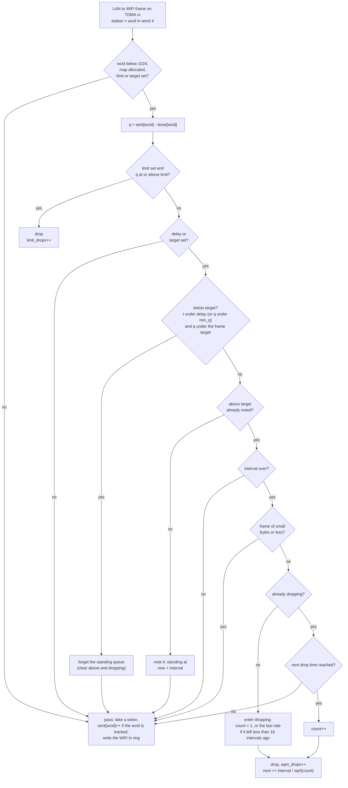
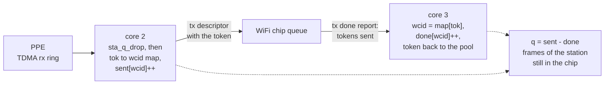
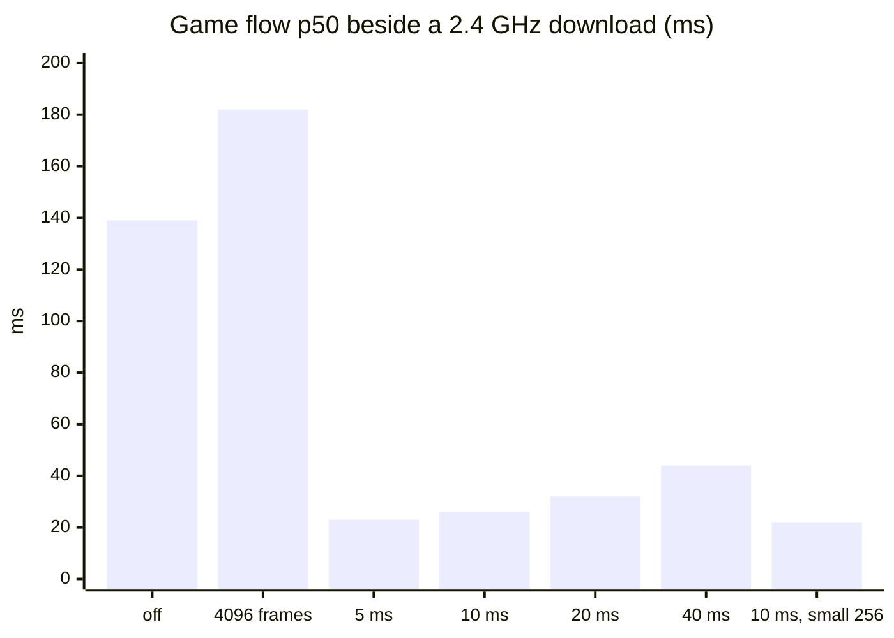
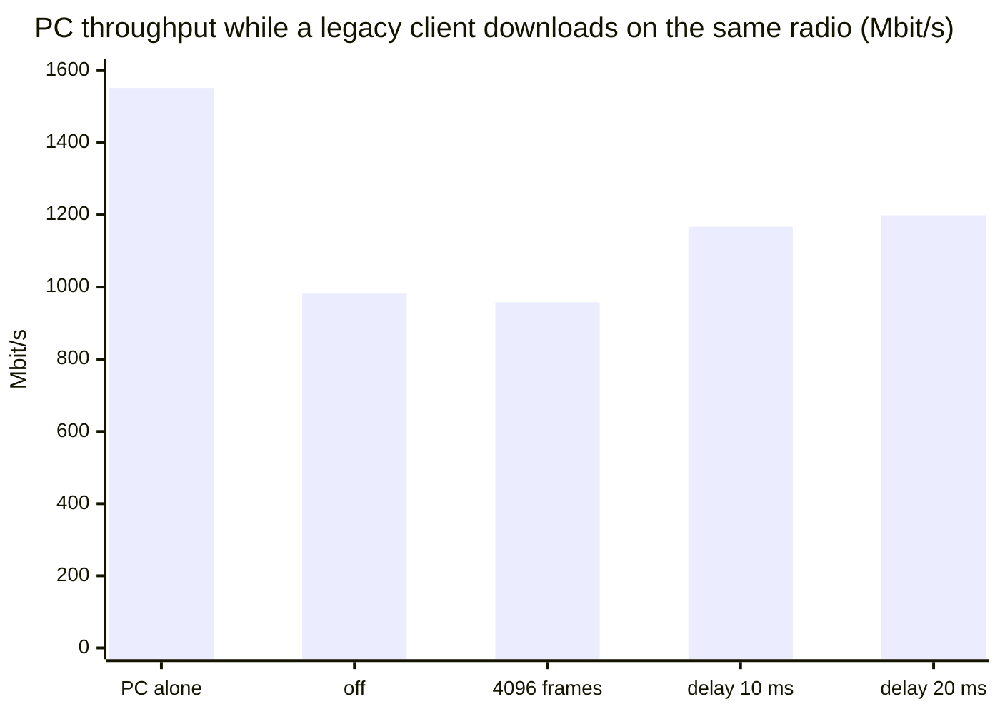
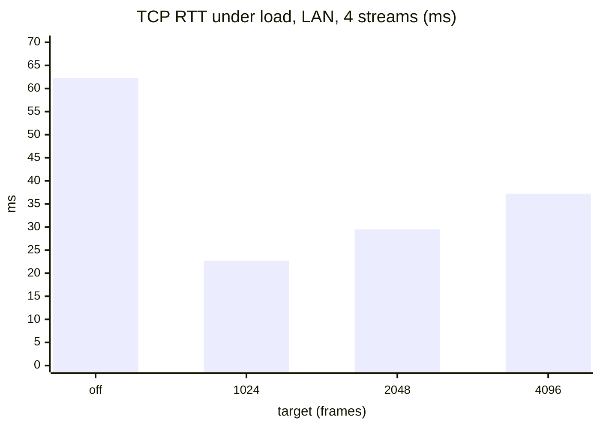
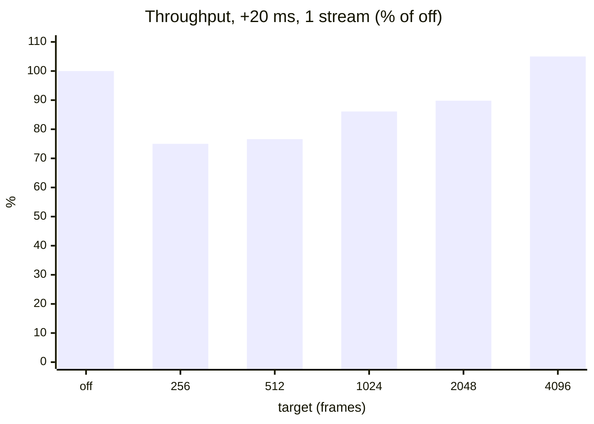
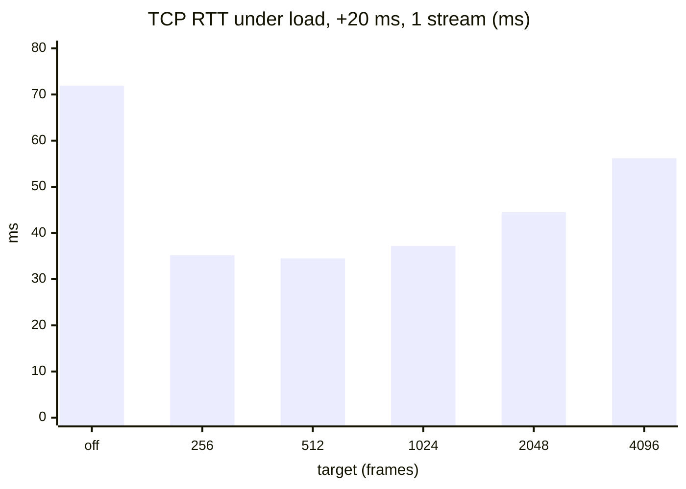

# Per-Station Queue Limit

LAN to WiFi frames the NPU forwards never pass through the host's
queueing (qdisc, fq_codel, AQL). The NPU hands each frame to the WiFi
chip with a tx token, and the chip keeps it until it is sent. The only
limit on that queue is the tx token pool, 13312 tokens of which 11007
are free when the TDMA rx rings are stocked (256 more are held back for
host frames over 2 KB, see [wifi-eagle.md](wifi-eagle.md#rings-and-buffers)), and every station on both
bands and the host path share it.

One fast download fills that queue:

- **Latency.** The sender's TCP window sits in the chip. A 1.3 Gbit/s
  download to one client keeps 4000 to 10000 frames there, 40 to 70 ms
  of queueing on every packet of that station.
- **Stability.** When the pool runs dry the NPU drops LAN frames at
  random, and host frames to every station (ARP, DHCP, EAPOL, the first
  packets of a flow before HWNAT binds it, CPU traffic) wait for a
  token. Under a 2 Gbit/s flood at one client the NPU refused 33000
  host frames a token, and a ping to that client stalled up to 2.6 s.

A queue of frames is also the wrong unit. 4096 frames drain in 30 ms at
1.6 Gbit/s but in 220 ms at 2.4 GHz rates, and in half a second to a
legacy 802.11a/g client. A game or call packet to that station waits
behind all of it: the host path's ping does not, so ping under-reports it.

`npu_sta_q.c` counts each station's frames in the chip, times one of
them at a time through the chip, and drops early, per station, before
the queue stands. Code and hooks are in
[wifi-eagle.md](wifi-eagle.md#per-station-queue-limit).

## How it decides

For each LAN to WiFi frame, before it takes a token, with `q` the
frames of its station in the chip and `t` the time its frames spend in
the chip:

1. `q >= limit`: drop. A hard backstop; it keeps `11007 - limit`
   tokens for everyone else whatever one station does.
2. The queue is **above target** when `t >= delay` with at least
   `min_q` frames in the chip, or when `q >= target` (frames; off by
   default). Not above target: pass, and forget any earlier standing
   queue.
3. Above target for less than `interval`: pass. Bursts, TCP slow start
   and a client's short power save naps are allowed.
4. Above target for a whole `interval`: a standing queue. Drop one
   frame, then one every `interval / sqrt(n)` while it stands, `n`
   counting the drops, as CoDel does (RFC 8289). The first frame that
   finds the queue below target ends the drops.
5. Frames of `small` bytes or less are never dropped in step 4: TCP
   acks, game and voice packets cost little airtime and much when lost.
   They still count in `q` and still meet the hard limit.


```mermaid
flowchart TD
  F["LAN to WiFi frame on TDMA rx<br/>station = wcid in word 4"] --> T{"wcid below 1024,<br/>map allocated,<br/>limit or target set?"}
  T -- no --> P["pass: take a token,<br/>sent[wcid]++ if the wcid is tracked,<br/>write the WiFi tx ring"]
  T -- yes --> Q["q = sent[wcid] - done[wcid]"]
  Q --> L{"limit set and<br/>q at or above limit?"}
  L -- yes --> DL["drop<br/>limit_drops++"]
  L -- no --> TG{"delay or<br/>target set?"}
  TG -- no --> P
  TG -- yes --> B{"below target?<br/>t under delay (or q under min_q)<br/>and q under the frame target"}
  B -- yes --> R["forget the standing queue<br/>(clear above and dropping)"] --> P
  B -- no --> A{"above target<br/>already noted?"}
  A -- no --> S["note it: standing at<br/>now + interval"] --> P
  A -- yes --> W{"interval over?"}
  W -- no --> P
  W -- yes --> SM{"frame of small<br/>bytes or less?"}
  SM -- yes --> P
  SM -- no --> DS{"already dropping?"}
  DS -- no --> E["enter dropping:<br/>count = 1, or the last rate<br/>if it left less than 16 intervals ago"] --> DA
  DS -- yes --> N{"next drop time reached?"}
  N -- no --> P
  N -- yes --> C["count++"] --> DA["drop, aqm_drops++<br/>next += interval / sqrt(count)"]
```

A dropped frame never takes a token: its TDMA slot is re-armed with the
buffer it already holds. TCP answers the loss by halving its window
instead of filling the chip.

The count `q` comes from two counters per station, each written by one
hart only, so no lock is needed:


```mermaid
flowchart LR
  PPE["PPE<br/>TDMA rx ring"] --> C2["core 2<br/>sta_q_drop, then<br/>tok to wcid map,<br/>sent[wcid]++"]
  C2 -- "tx descriptor<br/>with the token" --> CHIP["WiFi chip queue"]
  CHIP -- "tx done report:<br/>tokens sent" --> C3["core 3<br/>wcid = map[tok],<br/>done[wcid]++,<br/>token back to the pool"]
  C3 -.-> Q2["q = sent - done<br/>frames of the station<br/>still in the chip"]
  C2 -.-> Q2
```

The time `t` comes from a probe per station. There is no room in SRAM
for a time stamp per token, so one frame per station is timed at a
time:

- Core 2, sending a frame of a station whose probe is free, notes the
  token and the time (`mcycle >> 16`, 91 us steps at 720 MHz).
- Core 3, freeing that token from a tx done report, stores how long it
  took and frees the probe; the next frame of the station is timed next.
- `t` is the last timed frame's time in the chip, or the age of the
  frame being timed if that is larger already, so a queue that stops
  moving counts at once. A probe older than about 1 s is dropped (a
  lost report or a WiFi restart) and the next frame is timed.

One sample per trip through the queue is enough for CoDel, which only
asks whether the delay has stayed above target for an interval. A short
queue drains fast and is sampled often.

## Settings

| field | default | unit | effect |
|---|---:|---|---|
| `limit` | 8192 | frames | hard cap per station; 0 turns it off |
| `target` | 0 | frames | standing queue threshold in frames; 0 turns it off |
| `interval` | 100 ms | cycles | how long a queue must stand; 72000000 at 720 MHz |
| `limit_drops` | | frames | drops by the hard cap, since boot |
| `aqm_drops` | | frames | drops against a standing queue, since boot |
| `delay` | 10 ms | cycles | standing queue threshold in time in the chip; 7200000 at 720 MHz; 0 turns it off |
| `min_q` | 64 | frames | a station with fewer frames in the chip is never above the delay target |
| `small` | 256 | bytes | frames this long or shorter are never dropped against a standing queue; 0 drops them too |

The fields are in this order in memory. With `limit`, `target` and
`delay` all 0 the limit is off and costs one test per frame.

### Changing them at run time

The eight fields are `struct wifi_sta_q`, whose NPU address the
[debug block](debug.md#pcie-descriptor-block) symbol table gives under
tag `SQLM` (`0x53514C4D`). From the host, values in hex:

```sh
sys memory 1e906a00 80           # symbol table: find the word 53514c4d
                                 # the next word is the address, e.g. 3e900208
sys memory 1e900208 20           # the eight fields, in order
sys memwl 1e90021c 36ee80        # delay 5 ms (3600000 cycles)
sys memwl 1e900224 0             # small frames drop too
sys memwl 1e90020c 1000          # frame target 4096, as before the delay target
sys memwl 1e90021c 0             # delay target off
sys memwl 1e900208 0             # hard cap off
```

Clear the top three bits of the address for the host view
(`0x3E900208` reads as `0x1E900208`). The address moves between
builds; read it from the symbol table rather than keeping it. A write
takes effect with the next batch the tx hart drains. The defaults come
back when the host sets up the tx done ring again, at WiFi driver load;
`wifi down` and `wifi up` keep the values and the counts.

## Measurements

### Delay target

AN7583 + MT7993, every setting switched at run time on one boot, in
rotating order, 3 rounds (4 for the two-client tie-break), 15 s TCP
runs with 4 streams and a 5 s settle. The game flow is 100-byte UDP
every 20 ms with DSCP 0, echoed by the client, beside the download:
it waits in the same chip queue as the download, which the host path's
ping does not. Clients: a 2.4 GHz USB station (2x2, 20 MHz), a WiFi 7
PC and a WiFi 6 laptop on 5 GHz (160 MHz).

| setting | 2.4 GHz Mbit/s | 2.4 GHz TCP RTT | game p50 / p99 | game loss | PC alone | 2 x 5 GHz total | laptop RTT |
|---|---:|---:|---:|---:|---:|---:|---:|
| off | 225 | 226 ms | 139 / 400 ms | 60 % | 1545 | 1460 | 60 ms |
| frame target 4096 | 226 | 183 ms | 182 / 233 ms | 30 % | 1542 | 1456 | 59 ms |
| delay 5 ms | 227 | 30 ms | 23 / 63 ms | 3.2 % | 1524 | 1409 | 26 ms |
| delay 10 ms | 229 | 33 ms | 26 / 60 ms | 5.2 % | 1546 | 1406 | 29 ms |
| delay 20 ms | 227 | 40 ms | 32 / 65 ms | 4.6 % | 1543 | 1414 | 26 ms |
| delay 40 ms | 227 | 52 ms | 44 / 97 ms | 3.6 % | 1514 | 1415 | 45 ms |
| **delay 10 ms, small 256** | 226 | **29 ms** | **22 / 53 ms** | **0 %** | 1510 | 1427 to 1371 | 27 to 29 ms |

A second 4-round test of the two 5 GHz clients: off 1456 Mbit/s
(laptop RTT 53 ms), delay 10 ms small 256 1427 (29 ms), delay 20 ms
small 256 1448 (36 ms). The PC alone and the PC at +20 ms RTT (about
300 Mbit/s, 26 ms) do not change with any setting: its queue never
stands.


```mermaid
xychart-beta
    title "Game flow p50 beside a 2.4 GHz download (ms)"
    x-axis ["off", "4096 frames", "5 ms", "10 ms", "20 ms", "40 ms", "10 ms, small 256"]
    y-axis "ms" 0 --> 200
    bar [139, 182, 23, 26, 32, 44, 22]
```

A game packet is only dropped against a standing queue if it is longer
than `small`; with 256 none of them is, and the game flow lost nothing.

### A slow client on a fast radio

A legacy 802.11a client (the USB station with HT turned off: 54 Mbit/s
at best, no aggregation, so every frame takes its own channel access)
on the same 5 GHz radio as the WiFi 7 PC, 3 rounds:

| | off | frame target 4096 | **delay 10 ms** | delay 20 ms |
|---|---:|---:|---:|---:|
| slow client alone, Mbit/s | 29.4 | 29.5 | 29.7 | 29.7 |
| slow client alone, TCP RTT | 497 ms | 499 ms | **38 ms** | 38 ms |
| slow client alone, retransmits per run | 680 | 690 | 84 | 86 |
| PC beside the slow client, Mbit/s | 982 | 958 | **1167** | 1199 |
| slow client beside the PC, Mbit/s | 10.5 | 9.8 | 8.0 | 7.3 |
| slow client's game flow beside the PC, p50 / loss | 374 ms / 30 % | 377 ms / 33 % | 93 ms / 0 % | 92 ms / 0 % |


```mermaid
xychart-beta
    title "PC throughput while a legacy client downloads on the same radio (Mbit/s)"
    x-axis ["PC alone", "off", "4096 frames", "delay 10 ms", "delay 20 ms"]
    y-axis "Mbit/s" 0 --> 1600
    bar [1552, 982, 958, 1167, 1199]
```

Without a time target the legacy client's queue grows to half a
second: 4096 frames take 2 s at its rate, so the frame target never
acts. Its deep queue keeps it contending for the channel with single
frames, and the PC loses 37 % of its rate. Held to 10 ms, the slow
client keeps its rate alone, gives up about a fifth of it under
contention, and the PC gets 19 % more.

### Frame target (the first design)

AN7583 + MT7993, 5 GHz 160 MHz. A WiFi 6 client (2x2, HE-MCS 11,
2.4 Gbit/s PHY) receives TCP (CUBIC, iperf3, 15 to 20 s) from a host on
a 2.5 Gbit/s LAN port. "+20 ms" adds 20 ms of delay at the sender, like
a server on the internet. TCP RTT is the mean smoothed RTT the sender
measured: the queueing its own packets saw. Runs of each setting were
interleaved with runs with the limit off; throughput is given against
those, as the client's rate drifted 1.2 to 1.35 Gbit/s between batches.
2 to 9 runs per point.

#### LAN, 4 streams

| target | throughput | vs off | TCP RTT |
|---|---:|---:|---:|
| off | 1308 Mbit/s | 100 % | 62.3 ms |
| 1024 | 1287 Mbit/s | 98.8 % | 22.7 ms |
| 2048 | 1287 Mbit/s | 98.2 % | 29.5 ms |
| **4096** | 1321 Mbit/s | 101.5 % | **37.2 ms** |


```mermaid
xychart-beta
    title "TCP RTT under load, LAN, 4 streams (ms)"
    x-axis "target (frames)" ["off", "1024", "2048", "4096"]
    y-axis "ms" 0 --> 70
    bar [62.3, 22.7, 29.5, 37.2]
```

With one stream: off 56.6 ms, 1024 16.5 ms, 2048 17.6 ms, 4096 26.6 ms,
throughput 97.5 to 99.9 % of off.

#### +20 ms, 1 stream

| target | throughput | vs off | TCP RTT |
|---|---:|---:|---:|
| off | 1195 Mbit/s | 100 % | 71.9 ms |
| 256 | 927 Mbit/s | 75.0 % | 35.2 ms |
| 512 | 947 Mbit/s | 76.6 % | 34.5 ms |
| 1024 | 1026 Mbit/s | 86.1 % | 37.2 ms |
| 2048 | 1034 Mbit/s | 89.8 % | 44.5 ms |
| **4096** | 1264 Mbit/s | 105.0 % | **56.2 ms** |


```mermaid
xychart-beta
    title "Throughput, +20 ms, 1 stream (% of off)"
    x-axis "target (frames)" ["off", "256", "512", "1024", "2048", "4096"]
    y-axis "%" 0 --> 110
    bar [100, 75.0, 76.6, 86.1, 89.8, 105.0]
```


```mermaid
xychart-beta
    title "TCP RTT under load, +20 ms, 1 stream (ms)"
    x-axis "target (frames)" ["off", "256", "512", "1024", "2048", "4096"]
    y-axis "ms" 0 --> 80
    bar [71.9, 35.2, 34.5, 37.2, 44.5, 56.2]
```

With 4 streams: off 83.5 ms; 1024 49.1 ms at 90.4 %; 2048 51.7 ms at
92.3 %; 4096 67.8 ms at 96.5 %. The 20 ms of added delay is part of
every RTT here.

#### Why not a fixed cap

A per-station cap alone (`limit` with `target` 0) gives the lowest
latency on the LAN (1024 frames: 6.8 ms, 1205 Mbit/s against 1236 off)
but tail drop cuts every burst, and at internet RTTs TCP never refills
the window:

| `limit`, +20 ms | 1 stream | 4 streams | TCP RTT, 1 stream |
|---|---:|---:|---:|
| off | 1101 Mbit/s | 1001 Mbit/s | 76.6 ms |
| 1024 | 360 Mbit/s | 437 Mbit/s | 26.6 ms |
| 2048 | 556 Mbit/s | 666 Mbit/s | 29.8 ms |

Hence the default cap is far above any standing queue (8192) and the
standing queue drops do the work.

#### Token pool and host frames

A WiFi 7 station ran three internet speed tests over a 2.5 Gbit/s uplink
with the limit off, then three with `target` 2048: download 1114 and
1091 Mbit/s on average (the upload, which the limit does not touch,
varied 1425 to 1817 Mbit/s over the same runs). Drops because the token
pool ran dry: 9507 with the limit off, 277 with it on, plus 1126 drops
against the standing queue.

A UDP flood of 2.4 Gbit/s (199 kpps) at one client: the NPU forwards
197 to 198 kpps with the limit on or off; with `limit` 8192 the
station's frames in the chip stop at exactly 8192 and the pool never
runs dry.

## Pros and cons

| | |
|---|---|
| + | A target in time fits every link rate: 30 ms of queue at 2.4 GHz instead of 180 to 230 ms, 38 ms instead of 500 ms for a legacy client, with the same throughput. |
| + | Game and call packets beside a download wait 20 to 30 ms instead of 140 to 180 ms, and small frames are never dropped early. |
| + | A slow client no longer holds the channel with a deep queue: a fast client beside it gets up to a fifth more. |
| + | One station can no longer drain the shared token pool, so host traffic and other stations keep getting tokens. |
| + | Drops come early and one at a time, not in bursts when the pool is empty: fewer retransmissions. |
| + | No locks: every count and probe field has one writer. |
| + | Every value changes at run time, per the table above. |
| − | Two fast clients on one radio lose up to 2 to 6 % of their sum, and the slower of them gives up share: it meets the delay target first. `delay` 20 ms gives that back for a few ms more queue at 2.4 GHz. |
| − | One frame per station is timed at a time, so `t` lags a sudden change by up to one trip through the queue. |
| − | Core 2 spends about 155 cycles more per LAN to WiFi frame with the delay target than with everything off (1194 against 1039, `ELAN` in a `PROF=1` build), 65 more than with the frame target alone. Its ceiling falls from about 690 to 600 kpps, several times what one radio carries. |
| − | Only wcids below 1024 are tracked; others pass unlimited. |
| − | Drops only; no ECN marking, and one queue per station, not per flow. A packet marked DSCP EF goes to the chip's voice queue and waits far less (7 ms against 190 ms at 2.4 GHz, measured with no time target); unmarked flows share the station's queue. |
| − | The upload direction (WiFi to LAN) is not limited, nor are frames the host sends to WiFi unless built with `CLANKER=1`; the host queues those. |

## Where it applies

`HAS_EAGLE_STA_QLIMIT`: the eagle builds whose NPU runs the WiFi tx path
(AN7581 MT7992, AN7583 MT7992 and MT7993). The kite datapath has no per
frame token in the NPU, and AN7552 leaves LAN to WiFi traffic to the host.
