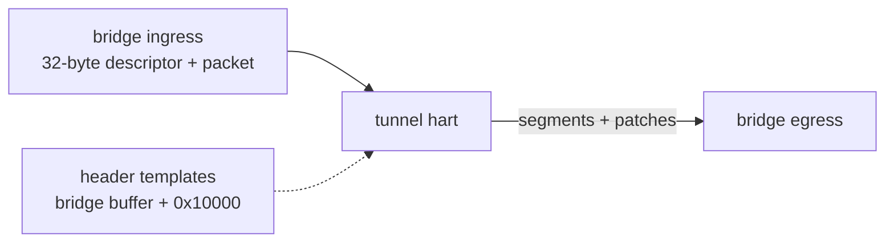
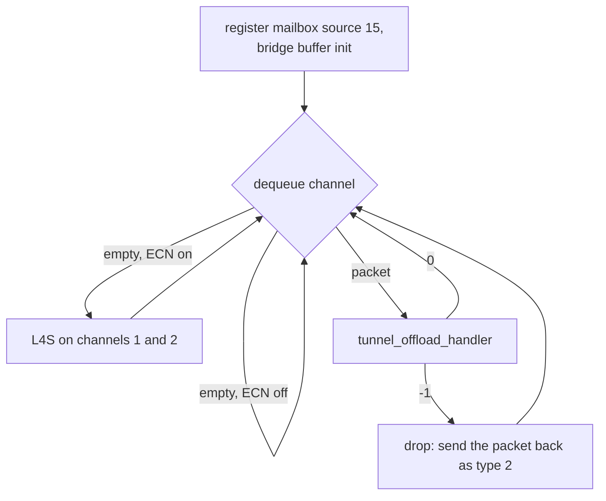

# Tunnel Offload, NPU Bridge and PPE

AN7581 and AN7583 (`HAS_TUNNEL`). Packets that need a header rewrite
arrive on an NPU bridge channel. The NPU rewrites them and sends them
back out through the bridge.

| SoC | tunnel hart | bridge channel it serves |
|---|---:|---:|
| AN7581 | 7 | 7 |
| AN7583 | 0, after WiFi init | 0 |

The same hart also runs L4S ECN marking on channels 1 and 2, and on
AN7581 the TR-471 init.



## NPU bridge

`npu_bridge_buf_init` allocates SRAM type 129 and programs:

```
0x1EC12008              packet buffer base (physical)
0x1EC12010 = 0x40800
0x1EC12018 = 1
0x1EC12210 + ch*16      channel status, bit 0 = buffer init done
```

It prints `npu bridge channel-N buf init sucess` or `fail` per channel.
AN7552 has 2 channels, AN7583 4, AN7581 8.

Per channel `ch`:

| register | use |
|---|---|
| `0x1EC12050 + ch*4` | bits 7:0 packets waiting, bits 15:8 egress credits |
| `0x1EC12080 + ch*16` | physical address of the next ingress descriptor |
| `0x1EC12100 + ch*32` | egress words: w0 at +0 is written last and commits |
| `0x1EC12290`.. | debug counters, reset by writing `0x1EC12370` |

An egress segment is seven words:

```
w0   source address (physical)
w1   length << 16 | offset into the source
w2   bit 31 first segment, bit 30 last, bits 27:24 type, bits 2:0 channel
w3..w6  up to four patches: 0xC0000000 | offset << 16 | be16 value
```

A patch rewrites a 16-bit field of the segment on its way out, so the
NPU never copies packet data to change a length or checksum.

`npu_bridge_egress` fails with `npu bridge egress fail` when the channel
has no credit.

## Tunnel loop



The ingress descriptor sits 32 bytes before the packet:

| field | meaning |
|---|---|
| word 0 bits 15:0 | packet length |
| word 0 bits 26:20 | offset of the IP header |
| word 0 bit 27, 28 | IPv4, IPv6 |
| word 1 bits 30:28 | 1 fragment, 2 reassemble, else tunnel |
| halfword 9 | fragmentation MTU |
| byte 20 | UDF, selects the tunnel operation |

On every rewritten packet the NPU sets the egress fields
`desc[0] = channel << 4`, `desc[4] = udf << 14 | 0x3800`,
`desc[5] = 0x7F4007FF` and `desc[6] = 0xFFFF`.

## Operations

| UDF | operation |
|---|---|
| 1..20 | VXLAN encapsulation with header template `udf - 1` |
| 21..40 | VXLAN decapsulation, strips the outer 50 bytes |
| 41..48 | SRv6 encapsulation with SRv6 template `udf - 41` |
| 49..56 | SRv6 endpoint: decapsulate, next segment, or last segment with PSP |
| 65..68 | address mapping: IPv4 and IPv6 header swaps from the mapping table |

Header templates live in the bridge buffer at `+0x10000`, 128 bytes each:
VXLAN templates at index 0..19, SRv6 templates at 20..27. The host
stores them with tunnel mail ids 0 and 3.

VXLAN encapsulation sends the descriptor, the template with its UDP and
IP lengths patched, then the packet. A packet above the VXLAN MTU (mail
id 2, default 1500) becomes two outer packets with the inner IPv4 split
at the MTU.

### Fragmentation

`desc[1]` op 1 splits a packet longer than its MTU into two fragments:

- IPv4: both fragments reuse the packet header, with length, flags,
  offset and checksum patched. `desc[0]` gets `0x1200` (AN7583) or
  `0x2200` (AN7581), ORed with the channel.
- IPv6: an 8-byte fragment header is built from patches in the scratch
  area at bridge buffer `+0xE00`, with a running identification.

A PPPoE session header, optionally behind one VLAN tag, gets its length
patched too.

### Reassembly

`desc[1]` op 2 holds the first fragment and sends both as one packet
when the second arrives. One fragment per family is held at a time; a
new first fragment drops the held one (`pkt loss 1`). Bridge debug op 2
drops whatever is held.

## L4S ECN marking

Enabled by tunnel mail id 8. For each packet waiting on channel 1 or 2:

1. rewrite the descriptor for egress on queue `l4s_qid` (default 7),
2. every 10 packets, read the QoS queue length
   (`0x1FB55100` for band 1, `0x1FB57100` for band 2),
3. if the queue is over the threshold (100), set ECN CE in the IPv4 or
   IPv6 header, past any VLAN tags or PPPoE header,
4. send it back on the same channel.

With debug on, it prints the packet and mark counts once per 100 timer
ticks.

## PPE and HWNAT

HWNAT mail id 1 (`HWNAT_INIT`) stores the board config and runs
`tunnel_init`, which programs the PPE. Every step keys on the chip
family (`0x1FB00064 >> 16`). Family 14 has a second PPE at `+0x1000`
that gets the same setup.

1. find the package in the chip capability table,
2. base PPE control and misc bits,
3. IP check blacklist,
4. parser: ethertypes and tags the PPE decodes, or the GDM ethertype
   match on families without a PPE parser,
5. FOE pause, filter table, GDM egress by PPE type,
6. flow table scan, bind rate limits and ageing timers,
7. forwarding control bits,
8. QDMA egress ports.

`HWNAT_DEINIT` clears the PPE control and misc bits, the FOE pause and
the QDMA egress ports. The `API` call writes an 80-byte FOE entry into a
PPE entry window, writes one value, or clears the 8192-entry table.

### xPON license check

On AN7581 and AN7583 with an eagle chip, core 3 runs
`xpon_license_check` every 300 timer ticks. Packages without an xPON
license, or limited to GPON/EPON, get the PON MAC disabled for the
unsupported modes.

## TR-471

AN7581 with WiFi. The tunnel hart calls `tr471_main_init` before its
loop, which clears the statistics block and prints
`tr471_main_init init 727 done`.
