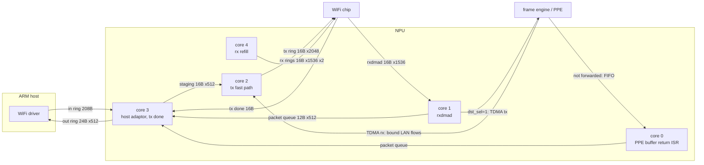

# Eagle WiFi Datapath (MT7991, MT7992, MT7993)

The eagle chips reorder frames themselves (RRO) and hand the NPU one
descriptor per received frame on the rxdmad ring. The NPU forwards each
frame to the wired side or to the host, keeps the chip's rx rings
stocked, and on AN7581 and AN7583 also feeds the chip's tx rings.

Code: `npu_wifi_eagle.c` (mail handlers, ring setup) and
`npu_wifi_eagle_dp.c` (the per-core loops).

## Cores

| core | loop | work |
|---:|---|---|
| 0 | `ppe_wifi_bufid_isr` (PLIC 95) | frames the PPE did not forward go to the host queue; free-only entries return the buffer. With `HAS_HOT_TEXT` it reads the FIFO count again before returning, up to 256 entries |
| 1 | `eagle_rxdmad_loop` | one rxdmad descriptor at a time: `dst_sel` frames to TDMA tx, the rest to the host queue; chains multi-buffer frames |
| 2 | `eagle_tx_fast_path` | staged host frames and the TDMA rx ring into the WiFi tx ring, paced by the ring's DMA index |
| 3 | `eagle_core3_loop` | host adaptor in rings to staging, packet queue to host adaptor out rings, tx done ring |
| 4 | `eagle_rx_refill_loop` | refills both rx rings |

AN7552 has two cores and no NPU tx path: core 1 runs the rxdmad loop and
core 0 runs `eagle_core0_loop`, which drains the packet queues and
refills the rx rings. See [AN7552](#an7552).

## Rings and buffers

| ring | location | entry | filled by |
|---|---|---:|---|
| rxdmad (indirect command) | PCIe descriptor block + `0x0E0A0` | 16 B | WiFi chip |
| rx ring 0, 1 | block + `0x00000`, `0x140A0` | 16 B | core 4 |
| MSDU page ring | block + `0x0E020` | 16 B | NPU, at ring init |
| WiFi tx ring 0, 1 | block + `0x06020`, `0x1A0C0` | 16 B | core 2 |
| tx done | host-given base | 16 B | WiFi chip |
| host adaptor in 0, 1 | `0x1EC0D0A0`, `0x1EC0D0B0` | 208 B | host |
| host adaptor out 0, 1 | `0x1EC0D180`, `0x1EC0D190` | 24 B | core 3 |
| TDMA tx 0, 1 | `0x1FB50800`, `0x1FB50810` | 8 B | core 1 |
| TDMA rx 0, 1 | `0x1FB50900`, `0x1FB50910` | 32 B | PPE |
| PPE buffer return | `0x1FB50FDC`..`0x1FB50FE4` | FIFO | PPE |

The PCIe descriptor block is SRAM type 1; see
[memory.md](memory.md#pcie-descriptor-block).

Two buffer pools:

- **rx buffer ids**: 12288 ids (11200 on AN7552) over the WiFi packet
  buffer, 2 KB each with 192 bytes of headroom. Whoever finishes with a
  frame returns its id: the PPE return ISR on core 0, the rxdmad hart
  on a drop, core 3 after the host copy. Returns take mutex 13 and read
  the ring's write index only while holding it. With `HAS_HOT_TEXT`
  mutex 13 and the packet queue's mutex 10 are taken inline.
- **tx tokens**: 13312 tokens over the NPU tx packet buffer. The tx done
  ring returns them.

With `HAS_ID_BATCH` (AN7583) both pools move ids in batches, one mutex
hold each: the refill takes up to 32 ids for the slots the chip handed
back, the host drain returns the ids of up to 16 frames, the tx done
ring frees up to 32 tokens, and the LAN to WiFi drain takes tokens for
up to 8 filled TDMA descriptors and gives back any it did not use. The
host drain stops after a frame the full out ring refused.

## Bring-up

The host hands over the rings with WiFi SET_WAIT and GET_WAIT mails
(see [mailbox.md](mailbox.md#wifi-commands-slot-0)). The interface id in
the mail header is a ring id.

| ring id | ring |
|---:|---|
| 0, 1 | rx rings |
| 5, 6 | MSDU page ring / WiFi tx rings |
| 8, 9 | indirect command (rxdmad) ring |
| 10, 11 | tx done rings |
| 15 | all bases set |

Each loop waits for its own set of flags:

| core | starts when |
|---:|---|
| 1 | rx and tx enabled (SET_WAIT 24 cases 2 and 7) |
| 2 | core 0 init done, tx done ring set up (SET_WAIT 1, ring 10), tx on (case 7) |
| 3 | core 0 init done, RRO state up and tx enabled |
| 4 | core 0 init done, rx and tx enabled, both rx rings set up (SET_WAIT 1, rings 0 and 1) |

A stop (case 4) clears the flags and every loop idles until they are set
again.

`GET_WAIT 4` answers per ring id with a physical address
(`& 0x1FFFFFFF`), and the host programs the chip from it:

| id | answer |
|---:|---|
| 0, 1 | rx ring base |
| 5, 6 | WiFi tx ring base; sets every descriptor to `0x80000000` first |
| 8, 9 | rxdmad ring base |
| 10 | MSDU page ring base |

`SET_WAIT 24` (inode tx/rx register) cases:

| case | action |
|---:|---|
| 0 | RRO address element table: 128 tables of 64 KB, 8 sessions each |
| 1 | particular session table |
| 2 | rx on: TDMA flow control on, rx and tx enabled |
| 3 | re-arm one session's elements |
| 4 | stop: TDMA flow control off, every loop pauses |
| 5 | host register for the rxdmad cpu index |
| 6 | restart: wait for TDMA idle, rebuild buffer ids and counters |
| 7 | tx on |

## PCIe windows

The rings live in NPU SRAM. The WiFi chip reaches them through a PCIe
inbound window, a base and an end address, both physical. Until
`SET_WAIT 14` opens it, the chip can neither fetch a tx descriptor nor
write an rx one, and its DMA index never moves.

| register | PCIe 0 | PCIe 1 |
|---|---|---|
| base | `0x1FA90038` | `0x1FC28030` (`0x1FA90030` on AN7552) |
| end | `0x1FA9003C` | `0x1FC28034` (`0x1FA90034` on AN7552) |

| port type | mapping |
|---:|---|
| 0 | PCIe 1 gets the whole block |
| 1 | PCIe 0 gets the whole block |
| 2 | band 0 (up to rx ring 1) on PCIe 1, band 1 on PCIe 0 |
| 3 | band 0 on PCIe 0, band 1 on PCIe 1 |

## Descriptors

- **Own bit.** Bit 31 of word 1 on rx and tx rings; set means the NPU
  owns the slot. A refill hands a slot back with
  `{phys + 192, 0x07000100, id << 16}`. A tx push writes `0x4C4048`.
- **Generation.** The rxdmad ring has no own bit. Each descriptor
  carries a 4-bit generation in the top nibble of word 3 (word 1 on the
  8-byte indirect command ring) that the chip increments on every wrap;
  the NPU tracks the one it expects. Ring init stamps every descriptor
  with `0xF` (`0xE` on the narrow ring), a value the NPU never expects,
  so an untouched ring reads as empty.
- **CPU index.** Every ring the chip fills needs its cpu index advanced,
  or the chip stalls when it catches up:

  | ring | when | written to |
  |---|---|---|
  | rxdmad | every 128 descriptors | ring register + 8, or the host register from case 5 |
  | rx ring 0, 1 | every 128 refills | ring register + 8 |
  | tx done | every 16 | ring register + 8 |

## Traffic directions

- **WiFi to LAN.** Core 1 sends `dst_sel=1` frames to TDMA tx. The PPE
  forwards bound flows and returns the rest on the buffer return FIFO;
  core 0 queues those to the host. With `HAS_HOT_TEXT` (AN7583) a whole,
  error-free frame with WiFi printing off takes a call-free path in
  `eagle_rxdmad_loop` to TDMA tx or the band 1 queue; any other
  descriptor goes to `eagle_rxdmad_handle`.
- **WiFi to host.** Frames without `dst_sel`, with errors, or with force
  to CPU set go on the packet queue; core 3 copies them to the host
  adaptor out ring and returns the buffer id.
- **Host to WiFi.** Core 3 copies host TXDs from the in ring into the
  staging ring; core 2 moves them into the ring 0/1 TXD space. TXD word 7
  bit 27 selects the token layout.
- **LAN to WiFi.** The host sends a flow itself until HWNAT binds it.
  After that the PPE delivers its frames on TDMA rx. Core 2 swaps a
  fresh tx token into the TDMA slot and fills the TXP words
  (`token << 16 | 0x80`, `wcid << 8 | bss | 0x1000000`, buffer, length)
  in the ring 5/6 TXD space.
- **Tx done.** Token reports (types 6 and 24) free tx tokens. Any other
  event is queued to the host on band 0.

## AN7552

- Two cores: core 1 rxdmad, core 0 packet queue drain and rx refill,
  started once init, rx, tx and both rx rings are up.
- No NPU tx path (`HAS_NPU_WIFI_TX` unset): no host adaptor in rings, no
  tx tokens, no TDMA rx ring. The tx ring mails print
  `TCSUPPORT_NPU_WIFI_TX is not set` and return 1.
- Core 0 masks PLIC 95 around buffer frees in its drain loop, because
  the ISR on the same hart frees under the same mutex.
- Chip family 15 with package variant 0 forces every frame to the CPU.
- A sync byte per buffer id (SRAM type 31) lets the rxdmad path wait
  briefly for a refill that has not landed yet.
