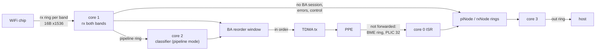
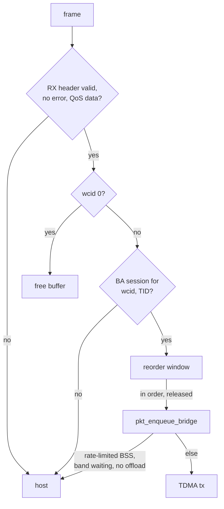

# Kite WiFi Datapath (MT7916, MT7996)

The kite chips deliver received frames unordered on one rx ring per
band. The NPU keeps the block ack (BA) reorder window for every station
and TID, sends in-order frames to the wired side over TDMA, and sends
the rest to the host.

Code: `npu_wifi_rx.c` (rx loops, classifier), `npu_wifi_ba.c` (reorder),
`npu_wifi_fwd.c` (host node rings), `npu_wifi_init.c` and
`npu_wifi_kite.c` (setup and mail handlers).

## Cores

| core | work |
|---:|---|
| 0 | init, then the BME ISR |
| 1 | 5 GHz rx ring; 2.4 GHz too when the driver model is DBDC |
| 2 | timer tick; 2.4 GHz rx when the driver model is 0; in pipeline mode, classifies 5 GHz frames for core 1 |
| 3 | drains the piNode and rxNode rings of both bands to the host |
| 4 | nothing |

AN7552 kite has two cores. Core 0 runs init, then drains both bands'
node rings to the host (core 3's job elsewhere); core 1 runs rx. Core
0 prints `is_wifi_link_up` (`0x1FA90050`) first; 6 means no tunnel
offload.

## Bring-up

`wifi_bridge_init` on core 0 resets the per-band state, allocates the
PCIe descriptor block, the BA node pool and the counters. Each band
comes up when the host sends SET_WAIT 1 (ring descriptors) for it,
which fills the rx ring and sets `rxd_2g_init_done` or
`rxd_5g_init_done`. Core 1 polls those flags.

Both bands' rx rings share SRAM block type 1: the first at its base,
the second `0x6000` further on AN7552 (`0x6020` elsewhere). The same
mail opens a PCIe inbound window over each band's ring, picked by the
host's port type: `PCIE0_WIN_*`, or `PCIE1_WIN_*` on AN7552 and
`PCIE0_MAC_BASE + 0x8030` on AN758x.

The interface id in a kite mail is a band: 0 for 2.4 GHz, 1 for 5 GHz.

## Rx ring

1536 descriptors of 16 bytes per band. Word 0 is the buffer DMA address;
the halfword at `+6` holds the buffer length.

For every received frame the loop:

1. takes a fresh buffer id from the buffer manager and puts it in the
   slot,
2. every 128 frames, writes the last consumed index to the chip's cpu
   index register (ring register `+ 8`),
3. hands the old buffer id to the classifier.

Buffer ids come from the hardware buffer manager (BMGR) through custom
CSRs: reading CSR `0xBC8 + band` pops one id, or -1 when it is empty.
AN7552 has no id CSRs: a 16-bit load from `0x1EC08800 + band * 0x800 +
(64 + band) * 4` pops the id instead.
When none is left, the loop flushes every BA window of the band to free
buffers.

A frame that spans several descriptors goes to the host. If it fits one
buffer, the pieces are copied into a fresh buffer; otherwise each piece
goes to the rxNode ring as a segment.

## Classifier

With the no-BA test flag set (SET_WAIT 9), every frame goes straight to
`pkt_enqueue_bridge`.

AN7552 hart 1 runs `kite_classify_fast` first. A parsed frame that is
the next SN of a running window (state 4), follows no A-MSDU restart,
and needs no rate limit, band wait or host offload goes to TDMA there,
with counters off. It takes the BA lock only when frames are held;
only hart 1 queues them. Any other frame continues in
`kite_classify_pn` without a second parse. About 90% of TCP frames take
the fast path; a frame costs about 1660 cycles, down from 2520.

## BA reorder

- One 28-byte entry per TID, 8 TIDs per wcid, in two tables (SRAM types
  7 and 8). On DBDC drivers wcid above 150 uses the first table,
  otherwise one table per band.
- Frames held in a window are 36-byte nodes from the node pool (type 4),
  indexed by two index pools (types 12 and 13).
- SET_WAIT 4 packs an ADDBA as tid (bits 2:0), wcid (10:3), window
  size (19:11) and start sequence number (31:20). The entry keeps the
  size at +16 and the SSN at +18; both 0 resets it to window 8.
- An entry moves from "ADDBA seen" (state 3) to "window running"
  (state 4) on its first frame, which sets the window start.
- In-order frames and frames that close a gap are released in sequence.
  Duplicates and frames behind the window are dropped, or bridged in
  fast mode. A frame far behind the window means the peer restarted: it
  is bridged and the window moves to it.
- Every 10 slow timer ticks, each rx loop scans its band's windows and
  releases frames held past the flush timeout (SET_WAIT 10 and 11).

## Host node rings

`pkt_forward` queues a frame for the host:

| ring | size | entry | holds |
|---|---:|---:|---|
| piNode 2.4 GHz / 5 GHz | 256 / 512 | 16 B | whole frames, with wcid, A-MSDU and rx info |
| rxNode per band | 128 | 12 B | one segment of a longer frame |

Cores 1 and 2 both fill the piNode rings, so the write takes a hardware
mutex. Core 3 drains each ring into the host adaptor out ring and frees
the buffer id. A full ring returns 1 and the caller frees the buffer.

## Pipeline mode

Fast flag bit 0 (SET_WAIT 17) splits 5 GHz work across two cores:
core 1 only refills the ring and queues `{buffer id, length}` into the
pipeline ring (SRAM type 21, 3200 entries of 8 bytes), and core 2
classifies them. TDMA tx then takes a mutex because both cores submit.
AN7552 has no core 2 and no pipeline: core 1 always classifies, and
type 21 is never allocated. TDMA tx always takes the mutex there, since
core 0's mail handlers send the frames a BA flush releases.

## Returning unforwarded frames

Frames the PPE does not forward come back on the BME ring
(see [dma.md](dma.md#bme-ring-kite)). Core 0's ISR puts them on the
piNode ring for the host.
